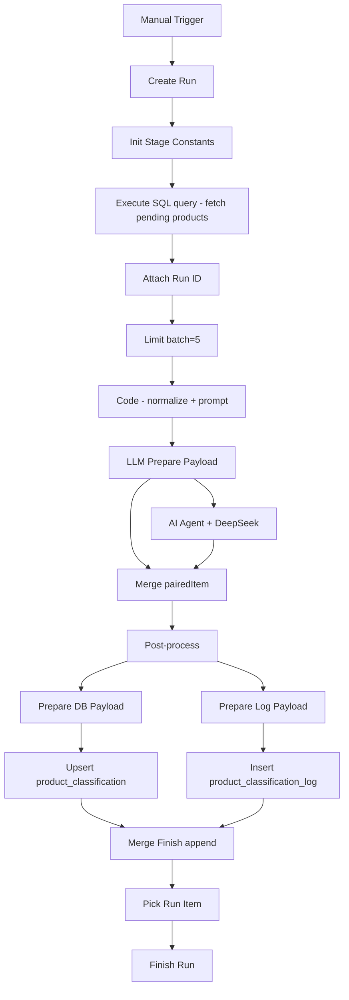

# Pharmacy Product Classifier — описание проекта

## Цель

Production-like агент классификации аптечных товаров на стеке **n8n + PostgreSQL + LLM**. Управление БД — через pgAdmin.

| Документ | Назначение |
|----------|------------|
| `Categories/Categories.rtf` | Исходное ТЗ и архитектурные правила |
| `Categories/stage2_project_description.md` | Бизнес-описание для заказчика (5 этапов, batch, прозрачность) |
| `Categories/category_recognition_customer.md` | Краткий процесс + схема + тексты промптов для заказчика |
| `Categories/stage2_workflow_plan.md` | Журнал выполненных задач и roadmap |
| `Categories/stage2_workflow_contract.md` | Контракт workflow для разработки |
| `Categories/stage2_node_map.md` | Карта процесса и нод — справочник для заказчика |
| `Categories/multi_agent_plan.md` | План мультиагентной разработки в Cursor |
| `redesign/00_PROJECT_STATUS.md` | Redesign status: implemented Stage 2 vs approved hierarchy plan |
| `redesign/20_MIGRATION_PLAN.md` | Hierarchy cascade migration plan v1 (approved design) |

## Бизнес-логика (из stage2_project_description)

Система обрабатывает товары **партиями** (batch), для каждой партии создаётся отдельный запуск с итоговой статистикой. Принцип: надёжное решение фиксируется автоматически; при сомнениях товар идёт на следующий уровень, а не «додумывается».

| Этап | Что делает | Результат |
|------|------------|-----------|
| 1. Подготовка + shortlist | Нормализация, rule-based shortlist | Товар готов к LLM |
| 2. Основное решение | Primary LLM (DeepSeek) | Простые кейсы → `classified` |
| 3. Уточнение | Fallback 2A → 2B | Сложные кейсы — второй шанс |
| 4. Спорные случаи | Judge (Polza / Qwen) | Арбитраж конфликтов |
| 5. Ручная верификация | Telegram | Только действительно спорные товары |

Текущая реализация — **этап 2 (primary round)** + инфраструктура учёта; этапы 3–5 в разработке, схема БД уже подготовлена.

## Архитектура классификатора

```
import / normalize
    → Stage 1: ShortList workflow (rule engine → classification_shortlist)
    → Stage 2 primary LLM (DeepSeek API, shortlist-constrained)
    → fallback 2A (rules по categories_dict + DeepSeek)
    → fallback 2B (branch shortlist + DeepSeek)
    → judge (Polza.ai / Qwen — отдельная модель для спорных кейсов)
    → human review (Telegram)
```

### Стратегия моделей

| Стадия | Модель | Credential в n8n | Назначение |
|--------|--------|------------------|------------|
| Primary LLM | **DeepSeek** | DeepSeek account | Дешёвый основной раунд |
| Fallback 2A LLM | **DeepSeek** | DeepSeek account | Выбор direction/block в рамках categories_dict |
| Fallback 2B | **DeepSeek** | DeepSeek account | Уточнение category_id в branch shortlist |
| Judge | **Polza.ai** (Qwen) | Polza API (OpenAI-compatible) | Спорные ситуации, конфликты, проверки |

**Принципы:**

- DeepSeek — дешёвая модель для массовых раундов (primary, 2A, 2B).
- Polza / Qwen — отдельная модель только для judge и спорных проверок.
- LLM не обязан выбирать категорию из shortlist, если shortlist ненадёжен → `category_id = null` → fallback.
- Fallback 2A — **rule + LLM по `categories_dict`**, не свободное гадание (см. ниже).
- После каждого LLM-шага: parse JSON → validate → routing → snapshot + event log.
- Code-ноды: всегда `...item.json`, единый `run_id` на весь запуск Stage 2.
- Интеграция LLM: AI Agent + Chat Model + Code post-processing (не Structured Output Parser).

## Репозиторий

| Путь | Назначение |
|------|------------|
| `Categories/Categories.rtf` | Исходное ТЗ и архитектурные правила |
| `Categories/stage2_project_description.md` | Бизнес-описание для заказчика |
| `Categories/category_recognition_customer.md` | Процесс + схема + промпты для заказчика |
| `Categories/stage2_workflow_plan.md` | Выполненные задачи + план дальнейших шагов |
| `Categories/stage2_workflow_contract.md` | Контракт workflow для разработки |
| `Categories/PROJECT.md` | Этот файл — обзор проекта и текущая реализация |
| `Categories/multi_agent_plan.md` | План мультиагентной работы в Cursor |
| `redesign/00_PROJECT_STATUS.md` | Redesign status: implemented Stage 2 vs approved hierarchy plan |
| `redesign/20_MIGRATION_PLAN.md` | Hierarchy cascade migration plan v1 (approved design) |
| `workflows/shortlist.json` | **Stage 1** — rule-based shortlist |
| `workflows/shortlist.id` | ID на n8n: `7hx7k2mhJCbA57BG` |
| `workflows/classification-stage2-prepare-for-llm.json` | **Эталон** Stage 2 (primary LLM), read-only baseline |
| `workflows/classification-stage2-prepare-for-llm.id` | ID эталона на n8n: `QhY8kzAWNVZXtp8C` |
| `workflows/classification-stage2-dev.json` | **Рабочая копия** для дальнейшей разработки |
| `workflows/classification-stage2-dev.id` | ID копии на n8n: `BaBjEPi78taRj2G5` |
| `scripts/pull_workflow.py` | Скачать workflow с n8n в `workflows/` |
| `scripts/push_workflow.py` | Загрузить workflow из `workflows/` в n8n |
| `scripts/deploy_workflow.py` | Deploy по имени (create/update) |
| `.env` | `N8N_URL`, `N8N_API_KEY` |

**n8n instance:** `https://n8n.sychovtest.ru`

**Workflow на сервере:**

| Имя | ID | В git | Роль |
|-----|-----|-------|------|
| `ShortList` | `7hx7k2mhJCbA57BG` | yes | Stage 1: rule-based shortlist |
| `classification-stage2-prepare-for-llm` | `QhY8kzAWNVZXtp8C` | yes | Эталон Stage 2 primary |
| `classification-stage2-dev` | `BaBjEPi78taRj2G5` | yes | Dev-копия Stage 2 |
| `Classifier` | `vBlanLU9o7Y7OVNL` | no | Ранний прототип |

## Stage 1 — ShortList workflow

Workflow `ShortList` — **8 нод**, rule engine без LLM:

```
Manual Trigger
  ├─ Товары (SELECT products_prepared, limit 100)
  └─ категории (SELECT categories_dict WHERE is_active)
       → Merge → Code in JavaScript (scoring)
       → Execute SQL (classification_shortlist)
       → product_classification (upsert)
       → product_classification_log (insert)
```

**Code-нода** реализует scoring по:

- `product_type_guess` (drug, cosmetic, device, supplement, …)
- keyword match: `category_name`, `need_nosology`, `mnn_cluster`, `include_keywords`, `exclude_keywords`
- оси: `age_segment`, `administration_route`, route/age hints из текста товара
- выход: top-5 shortlist, `top_category_id`, `top_score`, `product_type_guess`

Результат пишется в `classification_shortlist` и `product_classification` (`rule_decision_status`, `decision_status='pending'`), после чего товар попадает в Stage 2.

## Схема PostgreSQL (public)

Подтверждённые таблицы:

- `products_raw`, `products_prepared` — сырые и подготовленные товары
- `categories_dict`, `categories_raw` — справочник категорий
- `classification_shortlist` — shortlist по стадиям (`stage`, `shortlist_type`, `parent_stage`, `shortlist_metadata`)
- `product_classification` — snapshot классификации по товару (upsert по `product_id`)
- `product_classification_log` — event log по стадиям (`stage`, `run_id`)
- `classification_runs` — сущность запуска Stage 2
- `classification_review_queue` — очередь human review (`pending` → `sent_to_telegram` → `in_review` → `resolved`/`unresolved`); см. `human_review_contract.md`
- `pipeline_settings` — runtime-настройки (например `telegram_review_chat_id`)

Таблиц `categories`, `product_categories`, `category_tree`, `rules_shortlist` в public schema нет.

### Ключевые контракты

**`decision_status`:** `classified` | `needs_human_review` | `pending_fallback` | `error`

**`final_source`:** `rules` | `llm` | `fallback_2b` | `judge` | `human` | `system`

**`stage` (log):** `rule_shortlist` | `primary_llm` | `fallback_2a` | `fallback_2b` | `judge` | `human_review`

**`next_action`:** `none` | `fallback_2a` | `judge` | `human_review`

## Текущая реализация Stage 2 (primary LLM round)

Workflow `classification-stage2-dev` — **19 нод** (после Фазы 1: удалён `Merge Run Context`). Эталон `classification-stage2-prepare-for-llm` — 20 нод, не менялся. Реализован **только primary LLM round**; fallback 2A/2B, judge и Telegram — в разработке.

### Поток выполнения



### Ноды и ответственность

| Нода | Тип | Назначение |
|------|-----|------------|
| Create Run | Postgres | INSERT в `classification_runs`, status=`running` |
| Init Stage Constants | Code | Канонические константы: stage, decision_status, thresholds, model aliases |
| Execute a SQL query | Postgres | Выборка товаров `decision_status='pending'`, join с `classification_shortlist` |
| Attach Run ID | Code | Прокидывает `run_id` и `run_meta` в каждый item |
| Limit | Limit | Batch size (5 в Create Run metadata) |
| Code | Code | Нормализация: `combined_text`, `product_type_guess`, shortlist, `userPrompt`, `deepseek_body` |
| LLM Prepare Payload | Code | Контекст для Merge + поля `prompt_system` / `prompt_user` для AI Agent |
| AI Agent + DeepSeek | LangChain | Вызов модели, ожидается JSON: `category_id`, `confidence`, `explanation` |
| Merge | Merge | Объединение контекста товара и LLM-ответа по `pairedItem` |
| Post-process | Code | Parse/validate JSON, routing (`next_action`, `routing_hint`), snapshot + log structs |
| Prepare DB Payload | Code | SQL-ready snapshot для `product_classification` |
| Upsert | Postgres | INSERT ON CONFLICT по `product_id` |
| Prepare Log Payload | Code | SQL-ready event для `product_classification_log` |
| Insert | Postgres | INSERT в log (без upsert) |
| Merge Finish | Merge | Barrier: append, ждёт Upsert + Insert |
| Pick Run Item | Code | Один item с `classification_runs.id` из `$('Create Run')` |
| Finish Run | Postgres | Агрегация статистики, UPDATE `classification_runs` (LEFT JOIN, всегда финализирует) |

### Routing primary round (Post-process)

**Текущая реализация (v1):**

| Условие | decision_status | final_source | next_action |
|---------|-----------------|--------------|-------------|
| Валидный ответ, confidence > 0.60, category в shortlist | `classified` | `llm` | `none` |
| null category, invalid JSON, empty, outside shortlist | `pending_fallback` | `system` | `fallback_2a` |
| Валидный, conf в `(0.40, 0.60]` | `pending_fallback` | `system` | `fallback_2a` |
| Валидный, conf ≤ 0.40 | `needs_human_review` | `system` | `human_review` |

**Borderline policy (внедрена):** broken → `fallback_2a`; `(0.40, 0.60]` → `fallback_2a`; ≤ 0.40 → `human_review`; после fallback/judge низкая уверенность → Telegram.

Пороги зафиксированы: `min_confidence_ok=0.60`, `min_confidence_borderline_low=0.40`.

### Fallback 2A — зафиксированный подход

**Rule + LLM по `categories_dict`**, не свободный LLM:

- поля справочника: `direction`, `hierarchy_level`, `category_name`, `need_nosology`
- дополнительные оси: `product_type`, `administration_route`, `age_segment`, `mnn_cluster`, `differentiation_degree`, `is_active`
- keyword-логика: `include_keywords` / `exclude_keywords`
- LLM (DeepSeek) выбирает direction / block / family и опционально `nosology_hint` **в рамках** уже отфильтрованной схемы категорий
- финальная `category_id` на этапе 2A **не выбирается**

### Версии по умолчанию

- `workflow_version`: `stage2_primary_llm_v1`
- `prompt_version`: `prompt_primary_llm_v1`

### Подтверждённое тестирование

- Smoke-test run `8` (до Фазы 1): три сценария routing — snapshot и log согласованы.
- Run `6`: `status='finished'` (до фикса finish chain).
- **Фаза 1 runtime (run `9`, 2026-06-28):** `classification-stage2-dev` — `status='finished'`, `total_count=5`, `success_count=1`, `finished_at` заполнен; runs 7/8 backfill.

## Что ещё не реализовано

1. ~~**Finish Run**~~ — **стабилен** (Фаза 1 ✅, run 9)
2. **Routing policy v2** — low-confidence primary → fallback вместо прямого human_review
3. ~~**Fallback 2A**~~ — **готово** (run 11)
4. **Fallback 2B** — branch shortlist + DeepSeek
5. **Judge** — Polza / Qwen, арбитраж конфликтов
6. **Human-in-the-loop** — Telegram workflows + `classification_review_queue` (см. `human_review_contract.md`)
7. **Техдолг** — параметризованные SQL, индексы, диагностические запросы

## Рабочий процесс разработки

1. Эталон `classification-stage2-prepare-for-llm` не менять.
2. Все изменения — в `classification-stage2-dev` (локально + n8n).
3. После значимых изменений — обновлять `stage2_workflow_plan.md` по запросу «давай обновим файл проекта».
4. Синхронизация:
   - `python3 scripts/pull_workflow.py classification-stage2-dev`
   - `python3 scripts/push_workflow.py classification-stage2-dev`
   - `python3 scripts/pull_workflow.py shortlist` (Stage 1)

## Redesign status (2026-07-20)

Hierarchy migration plan v1 **approved as architecture design** — see `redesign/20_MIGRATION_PLAN.md` and `redesign/00_PROJECT_STATUS.md`.

- **Implemented today:** Stage 1 shortlist + Stage 2 pipeline in `classification-stage2-dev` (primary / 2A / 2B / judge; Sheets batch acceptance).
- **Not implemented:** semantic-first hierarchy cascade clone; no hierarchy SQL/workflow under the approved plan yet.
- **Locked v1 design choices:** clone-only; `categories_dict` text mapping; intermediate `pending_fallback`; terminal-only snapshot; Sheets human path / Telegram inactive; allowlist isolation design.
- **§13 clearance:** complete (artifacts `redesign/21a`, `21b`, `21`, `22`). B1/B2 *unblocked*, not started.

Note: sections above describing “primary-only / 19 nodes” may be outdated relative to the live `classification-stage2-dev` export; trust `stage2_workflow_contract.md` + workflow JSON for current Stage 2 detail.
