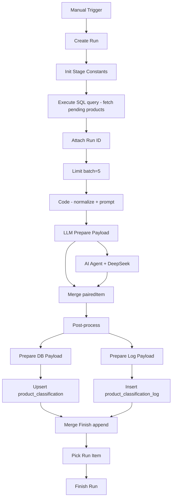

# Pharmacy Product Classifier — описание проекта

## Цель

Production-like агент классификации аптечных товаров на стеке **n8n + PostgreSQL + LLM**. Управление БД — через pgAdmin.

| Документ | Назначение |
|----------|------------|
| `Categories/Categories.rtf` | Исходное ТЗ и архитектурные правила |
| `Categories/stage2_project_description.md` | Бизнес-описание для заказчика (5 этапов, batch, прозрачность) |
| `Categories/category_recognition_customer.md` | Краткий процесс + схема + тексты промптов для заказчика |
| `Categories/stage2_workflow_plan.md` | Журнал выполненных задач и roadmap |
| `Categories/stage2_workflow_contract.md` | Контракт workflow для разработки |
| `Categories/n8n_execution_contract.md` | Одни live execution на workflow; чанки ≤ 10; стоп зомби |
| `Categories/agent_balance_bot_task.md` | ТЗ доработки `agent-balance-bot` (09:00 + команда) |
| `Categories/stage2_node_map.md` | Карта процесса и нод — справочник для заказчика |
| `Categories/multi_agent_plan.md` | План мультиагентной разработки в Cursor |
| `redesign/00_PROJECT_STATUS.md` | Redesign status: implemented Stage 2 vs approved hierarchy plan |
| `redesign/20_MIGRATION_PLAN.md` | Hierarchy cascade migration plan v1 (approved design) |
| `redesign/29_SHORT_ROADMAP.md` | Короткий roadmap hierarchy + offline MNN |
| `redesign/31_CHANGES_2026-08-19_to_2026-09-08.md` | Digest изменений 2026-08-19…2026-09-08 |

## Бизнес-логика (из stage2_project_description)

Система обрабатывает товары **партиями** (batch), для каждой партии создаётся отдельный запуск с итоговой статистикой. Принцип: надёжное решение фиксируется автоматически; при сомнениях товар идёт на следующий уровень, а не «додумывается».

| Этап | Что делает | Результат |
|------|------------|-----------|
| 1. Подготовка + shortlist | Нормализация, rule-based shortlist | Товар готов к LLM |
| 2. Основное решение | Primary LLM (DeepSeek) | Простые кейсы → `classified` |
| 3. Уточнение | Fallback 2A → 2B | Сложные кейсы — второй шанс |
| 4. Спорные случаи | Judge (Polza / Qwen) | Арбитраж конфликтов |
| 5. Ручная верификация | Telegram / Sheets | Только действительно спорные товары |

**Current Stage 2** (`classification-stage2-dev`): production-like pipeline primary → 2A → 2B → Judge; human path в основном через Sheets.  
**Hierarchy redesign** — отдельный clone (см. ниже); не заменяет prod Stage 2.

## Архитектура классификатора

```
import / normalize
    → Stage 1: ShortList workflow (rule engine → classification_shortlist)
    → Stage 2 primary LLM (DeepSeek API, shortlist-constrained)
    → fallback 2A (rules по categories_dict + DeepSeek)
    → fallback 2B (branch shortlist + DeepSeek)
    → judge (Polza.ai / Qwen — отдельная модель для спорных кейсов)
    → human review (Telegram)
```

### Стратегия моделей

| Стадия | Модель | Credential в n8n | Назначение |
|--------|--------|------------------|------------|
| Primary LLM | **DeepSeek** | DeepSeek account | Дешёвый основной раунд |
| Fallback 2A LLM | **DeepSeek** | DeepSeek account | Выбор direction/block в рамках categories_dict |
| Fallback 2B | **DeepSeek** | DeepSeek account | Уточнение category_id в branch shortlist |
| Judge | **Polza.ai** (Qwen) | Polza API (OpenAI-compatible) | Спорные ситуации, конфликты, проверки |

**Принципы:**

- DeepSeek — дешёвая модель для массовых раундов (primary, 2A, 2B).
- Polza / Qwen — отдельная модель только для judge и спорных проверок.
- LLM не обязан выбирать категорию из shortlist, если shortlist ненадёжен → `category_id = null` → fallback.
- Fallback 2A — **rule + LLM по `categories_dict`**, не свободное гадание (см. ниже).
- После каждого LLM-шага: parse JSON → validate → routing → snapshot + event log.
- Code-ноды: всегда `...item.json`, единый `run_id` на весь запуск Stage 2.
- Интеграция LLM: AI Agent + Chat Model + Code post-processing (не Structured Output Parser).

## Репозиторий

| Путь | Назначение |
|------|------------|
| `Categories/Categories.rtf` | Исходное ТЗ и архитектурные правила |
| `Categories/stage2_project_description.md` | Бизнес-описание для заказчика |
| `Categories/category_recognition_customer.md` | Процесс + схема + промпты для заказчика |
| `Categories/stage2_workflow_plan.md` | Выполненные задачи + план дальнейших шагов |
| `Categories/stage2_workflow_contract.md` | Контракт workflow для разработки |
| `Categories/PROJECT.md` | Этот файл — обзор проекта и текущая реализация |
| `Categories/multi_agent_plan.md` | План мультиагентной работы в Cursor |
| `redesign/00_PROJECT_STATUS.md` | Redesign status board |
| `redesign/20_MIGRATION_PLAN.md` | Hierarchy cascade migration plan v1 |
| `redesign/29_SHORT_ROADMAP.md` | Short roadmap |
| `redesign/31_CHANGES_2026-08-19_to_2026-09-08.md` | Digest 2026-08-19…2026-09-08 |
| `workflows/shortlist.json` | **Stage 1** — rule-based shortlist |
| `workflows/shortlist.id` | ID на n8n: `7hx7k2mhJCbA57BG` |
| `workflows/classification-stage2-prepare-for-llm.json` | **Эталон** Stage 2 (primary LLM), read-only baseline |
| `workflows/classification-stage2-prepare-for-llm.id` | ID эталона на n8n: `QhY8kzAWNVZXtp8C` |
| `workflows/classification-stage2-dev.json` | **Рабочая копия** Stage 2 (prod-like) |
| `workflows/classification-stage2-dev.id` | ID копии на n8n: `BaBjEPi78taRj2G5` |
| `workflows/classification-stage2-hierarchy-dev.json` | **Hierarchy clone** (Sem0→Sem1→attr Norm, snapshot-off) |
| `workflows/classification-stage2-hierarchy-dev.id` | ID на n8n: `o8sugljHYuUs7IEC` |
| `scripts/pull_workflow.py` | Скачать workflow с n8n в `workflows/` |
| `scripts/push_workflow.py` | Загрузить workflow из `workflows/` в n8n |
| `scripts/deploy_workflow.py` | Deploy по имени (create/update) |
| `scripts/n8n_executions.py` | Idle/wait/stop helpers (execution contract) |
| `.env` | `N8N_URL`, `N8N_API_KEY` |

**n8n instance:** `https://n8n.sychovtest.ru`

**Workflow на сервере:**

| Имя | ID | В git | Роль |
|-----|-----|-------|------|
| `ShortList` | `7hx7k2mhJCbA57BG` | yes | Stage 1: rule-based shortlist |
| `classification-stage2-prepare-for-llm` | `QhY8kzAWNVZXtp8C` | yes | Эталон Stage 2 primary |
| `classification-stage2-dev` | `BaBjEPi78taRj2G5` | yes | Prod-like Stage 2 |
| `classification-stage2-hierarchy-dev` | `o8sugljHYuUs7IEC` | yes | Hierarchy experiment (active but safe) |
| `Classifier` | `vBlanLU9o7Y7OVNL` | no | Ранний прототип |
| `agent-balance-bot` | `Ly8pjn4ZP51V1xA9` | yes | Ops: балансы DeepSeek/Polza — см. `agent_balance_bot_task.md` |
| `rx-otc-product-retrieval-dev` | `UqssZ24Jr7Qk9ef4` | yes | Offline RX/OTC skeleton — **inactive** |

## Stage 1 — ShortList workflow

Workflow `ShortList` — **8 нод**, rule engine без LLM:

```
Manual Trigger
  ├─ Товары (SELECT products_prepared, limit 100)
  └─ категории (SELECT categories_dict WHERE is_active)
       → Merge → Code in JavaScript (scoring)
       → Execute SQL (classification_shortlist)
       → product_classification (upsert)
       → product_classification_log (insert)
```

**Code-нода** реализует scoring по:

- `product_type_guess` (drug, cosmetic, device, supplement, …)
- keyword match: `category_name`, `need_nosology`, `mnn_cluster`, `include_keywords`, `exclude_keywords`
- оси: `age_segment`, `administration_route`, route/age hints из текста товара
- выход: top-5 shortlist, `top_category_id`, `top_score`, `product_type_guess`

Результат пишется в `classification_shortlist` и `product_classification` (`rule_decision_status`, `decision_status='pending'`), после чего товар попадает в Stage 2.

## Схема PostgreSQL (public)

Подтверждённые таблицы:

- `products_raw`, `products_prepared` — сырые и подготовленные товары
- `categories_dict`, `categories_raw` — справочник категорий
- `classification_shortlist` — shortlist по стадиям (`stage`, `shortlist_type`, `parent_stage`, `shortlist_metadata`)
- `product_classification` — snapshot классификации по товару (upsert по `product_id`)
- `product_classification_log` — event log по стадиям (`stage`, `run_id`)
- `classification_runs` — сущность запуска Stage 2
- `classification_review_queue` — очередь human review (`pending` → `sent_to_telegram` → `in_review` → `resolved`/`unresolved`); см. `human_review_contract.md`
- `pipeline_settings` — runtime-настройки (например `telegram_review_chat_id`)

Таблиц `categories`, `product_categories`, `category_tree`, `rules_shortlist` в public schema нет.

### Ключевые контракты

**`decision_status`:** `classified` | `needs_human_review` | `pending_fallback` | `error`

**`final_source`:** `rules` | `llm` | `fallback_2b` | `judge` | `human` | `system`

**`stage` (log):** `rule_shortlist` | `primary_llm` | `fallback_2a` | `fallback_2b` | `judge` | `human_review`

**`next_action`:** `none` | `fallback_2a` | `judge` | `human_review`

## Текущая реализация Stage 2 (prod-like)

Workflow `classification-stage2-dev` — production-like: **primary → fallback 2A → fallback 2B → Judge**. Эталон `classification-stage2-prepare-for-llm` — read-only baseline. Детали нод и routing — в `stage2_workflow_contract.md` и JSON workflow; секции ниже про «19 нод / primary-only» — исторический срез.

### Поток выполнения (исторический primary round)


```mermaid
flowchart TD
    T[Manual Trigger] --> CR[Create Run]
    CR --> ISC[Init Stage Constants]
    ISC --> SQL[Execute SQL query - fetch pending products]
    SQL --> ARI[Attach Run ID]
    ARI --> LIM[Limit batch=5]
    LIM --> NORM[Code - normalize + prompt]
    NORM --> LPP[LLM Prepare Payload]
    LPP --> AG[AI Agent + DeepSeek]
    LPP --> MRG[Merge pairedItem]
    AG --> MRG
    MRG --> PP[Post-process]
    PP --> PDB[Prepare DB Payload]
    PP --> PLP[Prepare Log Payload]
    PDB --> UPS[Upsert product_classification]
    PLP --> INS[Insert product_classification_log]
    UPS --> MF[Merge Finish append]
    INS --> MF
    MF --> PRI[Pick Run Item]
    PRI --> FR[Finish Run]
```

Актуальный полный граф (2A/2B/Judge) смотреть в `workflows/classification-stage2-dev.json` и `Categories/stage2_node_map.md`.

### Ноды primary round (справка)

| Нода | Тип | Назначение |
|------|-----|------------|
| Create Run | Postgres | INSERT в `classification_runs`, status=`running` |
| Init Stage Constants | Code | Канонические константы: stage, decision_status, thresholds, model aliases |
| Execute a SQL query | Postgres | Выборка товаров `decision_status='pending'`, join с `classification_shortlist` |
| Attach Run ID | Code | Прокидывает `run_id` и `run_meta` в каждый item |
| Limit | Limit | Batch size (smoke default **5**; contract cap **≤ 10**) |
| Code | Code | Нормализация: `combined_text`, `product_type_guess`, shortlist, `userPrompt`, `deepseek_body` |
| LLM Prepare Payload | Code | Контекст для Merge + поля `prompt_system` / `prompt_user` для AI Agent |
| AI Agent + DeepSeek | LangChain | Вызов модели, ожидается JSON: `category_id`, `confidence`, `explanation` |
| Merge | Merge | Объединение контекста товара и LLM-ответа по `pairedItem` |
| Post-process | Code | Parse/validate JSON, routing (`next_action`, `routing_hint`), snapshot + log structs |
| Prepare DB Payload | Code | SQL-ready snapshot для `product_classification` |
| Upsert | Postgres | INSERT ON CONFLICT по `product_id` |
| Prepare Log Payload | Code | SQL-ready event для `product_classification_log` |
| Insert | Postgres | INSERT в log (без upsert) |
| Merge Finish | Merge | Barrier: append, ждёт Upsert + Insert |
| Pick Run Item | Code | Один item с `classification_runs.id` из `$('Create Run')` |
| Finish Run | Postgres | Агрегация статистики, UPDATE `classification_runs` (LEFT JOIN, всегда финализирует) |

### Routing primary round (Post-process)

**Borderline policy (внедрена):**

| Условие | decision_status | final_source | next_action |
|---------|-----------------|--------------|-------------|
| Валидный ответ, confidence > 0.60, category в shortlist | `classified` | `llm` | `none` |
| null category, invalid JSON, empty, outside shortlist | `pending_fallback` | `system` | `fallback_2a` |
| Валидный, conf в `(0.40, 0.60]` | `pending_fallback` | `system` | `fallback_2a` |
| Валидный, conf ≤ 0.40 | `needs_human_review` | `system` | `human_review` |

Пороги: `min_confidence_ok=0.60`, `min_confidence_borderline_low=0.40`.

### Fallback 2A / 2B / Judge

- **2A:** rule + LLM по `categories_dict` (direction / block / family); финальная `category_id` на 2A не выбирается.
- **2B:** branch shortlist + DeepSeek → `category_id`.
- **Judge:** Polza / Qwen; арбитраж конфликтов; иначе human review.
- Подтверждённые runtime-прогоны и детали — журнал `stage2_workflow_plan.md` (п.19–24).

### Версии по умолчанию

- `workflow_version`: `stage2_primary_llm_v1` (исторический primary; актуальные stage versions — в workflow JSON)
- `prompt_version`: `prompt_primary_llm_v1`

### Подтверждённое тестирование (выборка)

- **Фаза 1 runtime (run `9`):** Finish Run стабилен — `status='finished'`, `total_count=5`, `success_count=1`.
- Fallback 2A/2B/Judge — закрыты в журнале (в т.ч. smoke до Judge).
- n8n ops: один live execution на workflow; чанки ≤ 10 — `n8n_execution_contract.md`.

## Что ещё открыто (Stage 2 + ops)

1. ~~Finish Run / 2A / 2B / Judge~~ — **готово** в `classification-stage2-dev`
2. **Telegram HITL** — workflows в репо, не основной path; primary human path = Sheets
3. **Техдолг** — параметризованные SQL, индексы, диагностические запросы
4. Hierarchy cascade Dir+ и offline MNN merge — **отдельный трек** (ниже), не правки prod Stage 2

## Рабочий процесс разработки

1. Эталон `classification-stage2-prepare-for-llm` не менять.
2. Prod-like изменения — в `classification-stage2-dev`; hierarchy — только в `classification-stage2-hierarchy-dev`.
3. После значимых изменений — обновлять `stage2_workflow_plan.md` (+ этот `PROJECT.md` при смене статуса).
4. Execution contract: один live run / workflow; LLM/Merge chunks **≤ 10**; зомби > 30 мин — stop.
5. Синхронизация:
   - `python3 scripts/pull_workflow.py classification-stage2-dev`
   - `python3 scripts/push_workflow.py classification-stage2-dev`
   - `python3 scripts/pull_workflow.py classification-stage2-hierarchy-dev`
   - `python3 scripts/pull_workflow.py shortlist` (Stage 1)

## Redesign status (2026-09-09)

Канон: `redesign/20_MIGRATION_PLAN.md`, статус: `redesign/00_PROJECT_STATUS.md`, roadmap: `redesign/29_SHORT_ROADMAP.md`, журнал: `Categories/stage2_workflow_plan.md` (п.25–51). Digest: `redesign/31_CHANGES_2026-08-19_to_2026-09-08.md`.

### Hierarchy clone

| | |
|--|--|
| Workflow | `classification-stage2-hierarchy-dev` (`o8sugljHYuUs7IEC`) |
| Status | **active but safe** — Load `WHERE false`; kill switch off; empty allowlist |
| Live path | Norm → **Sem0 → Sem1 → Normalize Sem attrs** → log-only (no snapshot) |
| Not wired | Dir / Need / Cat / Mnn / Judge |
| Prod Stage 2 | **unchanged** |

### Offline / gates (не в live Sem)

| Item | Status | Pointer |
|------|--------|---------|
| M3 RX/OTC | `KEEP_RX_OTC_P2_SUPPORT_ONLY` — workflow inactive | п.44 |
| M4 Age | pilot validated; audit-only | п.45 |
| M5.0 Norm v4 | done; **not** accepted for n8n | п.46 |
| M5.1 Norm v4.1 remediation | done; parallel `*_v4_1` only | п.47 |
| M5.1 human review | **`accept_for_controlled_integration`** | п.50; freeze `mnn_norm_v4_1_remediation_reviewed_v1.*` |
| Wave-100 Sem rubric | **PASS** `1/171 ≈ 0.58%` (exec19932) | п.51; freeze `sem_wave100_report_exec19932_reviewed_v1.*` |
| n8n execution contract | one live run; chunks ≤ 10 | п.48 |

### Next (explicit ask)

1. **B4** Direction + Need soft design в hierarchy-dev (unlocked by Wave-100 PASS).
2. Optional: policy_v2 Sem0+Sem1 spot-check before Wave-500.
3. Optional: Norm v4.1 controlled-integration **design** only (hierarchy-dev, allowlist 10–15, no `normalized_text` overwrite).
4. Optional: Manufacturer Alias Dictionary v1 (offline).

**Locked v1:** clone-only; terminal-only snapshot; Sheets human path; allowlist isolation (`hierarchy_experiment_enabled=false`).  
**Do not** without approval: merge MNN/RX/Age into `attr_*` / snapshot; activate RX workflow; rewrite prod Norm; `batch_size=100`/`500` in one LLM execution.
