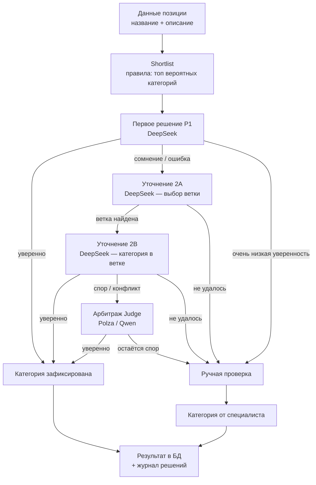

# Распознавание категории позиции — описание для заказчика

Документ фиксирует **текущий** процесс автоматического категорирования аптечной позиции: цепочку решений, блок-схему и тексты промптов к AI-моделям на каждом этапе.

**Источник промптов:** workflow `classification-stage2-dev` (ноды `P1 — Build Prompt`, `2A — LLM Prepare`, `2B — LLM Prepare`, `Judge — LLM Prepare`).  
**Версии промптов:** `prompt_primary_llm_v1`, `prompt_fallback_2a_v1`, `prompt_fallback_2b_v1`, `prompt_judge_v1`.

---

## Кратко

Система обрабатывает товар **по шагам**. Уверенное решение фиксируется сразу; при сомнении позиция уходит на следующий уровень. Система **не «додумывает»** категорию при низкой уверенности.

| Шаг | Что происходит | Модель | Если уверенно | Если сомнение |
|-----|----------------|--------|---------------|---------------|
| **1. Данные** | Нормализованное название и описание | — | — | — |
| **2. Shortlist** | Правила отбирают топ вероятных категорий | без LLM | готов к AI | — |
| **3. Первое решение (P1)** | Выбор `category_id` | DeepSeek | категория зафиксирована | → 2A или человек |
| **4. Уточнение 2A** | Выбор ветки (direction / block / family) | DeepSeek | → 2B | → человек |
| **5. Уточнение 2B** | Выбор категории внутри ветки | DeepSeek | категория зафиксирована | → Judge или человек |
| **6. Арбитраж (Judge)** | Разбор спора между раундами | Polza / Qwen | категория зафиксирована | → человек |
| **7. Человек** | Специалист в Telegram | — | финальная категория | — |

По каждой позиции сохраняется результат и журнал: какое решение принято и на каком шаге.

---

## Блок-схема



---

## Промпты к моделям

Ниже — фактические тексты system/user, которые уходят в модели.  
Плейсхолдеры вроде `${j.combined_text}` подставляются из данных товара в runtime.

Этап **Shortlist** промптов не использует (только правила).  
Этап **ручной проверки** — карточка специалисту в Telegram, без LLM-промпта.

---

### 3. Primary (P1) — первое решение

**Модель:** DeepSeek  
**prompt_version:** `prompt_primary_llm_v1`  
**Ожидаемый JSON:** `category_id`, `confidence`, `explanation`

#### System

```text
You classify pharmacy products into one category. Return ONLY a valid JSON object with keys: category_id, confidence, explanation.
```

#### User (шаблон)

```text
Товар (нормализованный текст):
${j.combined_text}

Тип товара по эвристике: ${j.product_type_guess}

Shortlist кандидатов категорий:
${shortlistText}

${ruleHint}

${shortlistPolicyText}

Задача:
- Выбери наиболее подходящую категорию для товара.
- Верни category_id, confidence и explanation.
- confidence должен быть числом от 0.0 до 1.0.
- explanation должен быть кратким, на русском, 1–3 предложения.
- Не добавляй комментарии вне JSON.
```

#### Варианты политики shortlist (`shortlistPolicyText`)

Подставляется один из трёх блоков в зависимости от силы rule-based shortlist:

**A. Shortlist пустой или низкоуверенный** (`rule_top_score < 10` или shortlist пуст):

```text
Политика выбора:
- Shortlist пустой или низкоуверенный.
- Рассматривай shortlist как слабую подсказку, а не как ограничение.
- Если видишь более подходящую категорию вне shortlist, можешь выбрать её.
- Если уверенно выбрать нельзя, верни category_id = null и в объяснении укажи, что нужен review.
```

**B. Сильный top candidate** (`rule_top_score ≥ 20`):

```text
Политика выбора:
- Rule-based слой дал сильный top candidate.
- В первую очередь проверь, подходит ли top candidate.
- Если top candidate не подходит, выбери лучшую категорию из shortlist.
- Если ни одна категория не подходит, верни category_id = null и укажи причину.
```

**C. Средний shortlist** (`10 ≤ rule_top_score < 20`):

```text
Политика выбора:
- Shortlist выглядит разумным, но не окончательным.
- Предпочитай выбор из shortlist.
- Если ни один кандидат не подходит, можешь выбрать категорию вне shortlist или вернуть category_id = null.
- Если выбор вне shortlist, кратко объясни почему shortlist оказался недостаточным.
```

`ruleHint` — одна из строк:

- `Rule engine suggests category_id=… as top candidate with score=….`
- `Rule engine has no strong suggestion.`

---

### 4. Fallback 2A — выбор ветки

**Модель:** DeepSeek  
**prompt_version:** `prompt_fallback_2a_v1`  
**Ожидаемый JSON:** `direction`, `block_family`, `family_code`, `nosology_hint`, `confidence`, `explanation`  
**Важно:** финальный `category_id` на этом этапе **не** запрашивается.

Если кандидатов ветки нет, LLM не вызывается (`skip_llm`).

#### System

```text
You select a pharmacy product branch (direction/block/family), NOT a final category_id. Return ONLY a valid JSON object with keys: direction, block_family, family_code, nosology_hint, confidence, explanation.
```

#### User (шаблон)

```text
Товар (нормализованный текст):
${j.combined_text}

Тип товара по эвристике: ${j.product_type_guess}

Контекст неудачи primary LLM:
${JSON.stringify(primaryFailureContext)}

Branch-кандидаты (выбери один):
${candidatesText}

Задача:
- Выбери наиболее подходящую ветку (direction, block_family, family_code).
- nosology_hint — опциональная подсказка по нозологии, если уместно.
- confidence — число от 0.0 до 1.0.
- explanation — кратко на русском, 1–3 предложения.
- НЕ возвращай category_id.
- Не добавляй комментарии вне JSON.
```

---

### 5. Fallback 2B — категория внутри ветки

**Модель:** DeepSeek  
**prompt_version:** `prompt_fallback_2b_v1`  
**Ожидаемый JSON:** `category_id`, `confidence`, `explanation`  
**Важно:** `category_id` обязан быть из branch shortlist (или `null`).

Если branch shortlist пуст, LLM не вызывается (`skip_llm`).

#### System

```text
You classify pharmacy products into one category within a pre-selected branch. Return ONLY valid JSON with keys: category_id, confidence, explanation. category_id MUST be from the branch shortlist.
```

#### User (шаблон)

```text
Товар:
${j.combined_text}

Тип товара: ${j.product_type_guess}

Выбранная ветка (fallback 2A):
${JSON.stringify(branchContext)}

Контекст неудачи primary LLM:
${JSON.stringify(primaryContext)}

Branch shortlist (выбери ОДНУ категорию ТОЛЬКО из списка):
${shortlistText}

Политика:
- category_id ОБЯЗАН быть из shortlist выше.
- Если ни одна категория не подходит — верни category_id=null и объясни.
- confidence: 0.0–1.0; explanation: 1–3 предложения на русском.
- Только JSON, без комментариев.
```

---

### 6. Judge — арбитраж

**Модель:** Polza.ai / Qwen  
**prompt_version:** `prompt_judge_v1`  
**Ожидаемый JSON:** `winner_source`, `category_id`, `confidence`, `explanation`, `needs_human_review`  
**`winner_source`:** одно из `llm` | `fallback_2b` | `none`

#### System

```text
You are a senior pharmacy product classification judge. Review prior automated rounds and return ONLY valid JSON with keys: winner_source, category_id, confidence, explanation, needs_human_review. winner_source must be one of: llm, fallback_2b, none. category_id must be from the allowed candidate ids or null if none fits.
```

#### User (шаблон)

```text
Товар:
${j.combined_text}

Тип товара: ${j.product_type_guess}
run_id: ${j.run_id}

Primary LLM (P1):
${JSON.stringify(primaryRound)}

Fallback 2A (ветка):
${JSON.stringify(fallback2a)}

Fallback 2B (категория в ветке):
${JSON.stringify(fallback2b)}

Контекст спора:
${JSON.stringify(disputeContext)}

Rule shortlist (primary):
${formatShortlist(ruleShortlist)}

Branch shortlist (fallback 2B):
${formatShortlist(branchShortlist)}

Задача:
- Выбери финальную category_id из объединения shortlist-ов выше, либо null если ни одна не подходит.
- winner_source: чей ответ вы предпочитаете (llm | fallback_2b | none).
- confidence: 0.0–1.0; explanation: 1–3 предложения на русском.
- needs_human_review=true если уверенность низкая или кандидаты противоречивы.
- Верни только JSON без markdown.
```

---

## Связанные документы

| Документ | Назначение |
|----------|------------|
| [`stage2_project_description.md`](stage2_project_description.md) | Бизнес-описание проекта |
| [`stage2_node_map.md`](stage2_node_map.md) | Карта нод и маршрутизация |
| [`stage2_workflow_contract.md`](stage2_workflow_contract.md) | Технический контракт workflow |
| [`PROJECT.md`](PROJECT.md) | Обзор реализации |
