# План мультиагентного выполнения в Cursor

Цель: параллельно и последовательно довести Stage 2 классификатора от primary-only до полного pipeline (fallback 2A/2B → judge → Telegram), не ломая эталон и сохраняя контракты БД.

**Рабочий workflow:** `classification-stage2-dev` (`BaBjEPi78taRj2G5`)  
**Эталон (read-only):** `classification-stage2-prepare-for-llm` (`QhY8kzAWNVZXtp8C`)  
**Канон:** `Categories/stage2_workflow_plan.md`, `Categories/PROJECT.md`

---

## Фазы и агенты

### Фаза 0 — Bootstrap (выполнено)

| Задача | Статус |
|--------|--------|
| Скачать эталон workflow в git | done |
| Скачать ShortList (Stage 1) в git | done |
| Создать dev-копию Stage 2 на n8n | done |
| Зафиксировать PROJECT.md + stage2_project_description.md | done |
| Скрипты pull/push | done |

---

### Фаза 1 — Стабилизация primary ✅ **закрыта**

**Агенты:** investigator → implementer → verifier  
**Runtime:** run `9` (2026-06-28), runs 7/8 backfill

| Задача | Статус |
|--------|--------|
| Диагностика runs 7/8 | done |
| Fix Finish Run chain в dev | done |
| total_count в metadata | decided |
| Init Stage Constants model aliases | done |
| Runtime smoke-test | done (run 9) |

---

### Фаза 2 — Fallback 2A ✅ **закрыта**

**Runtime:** run `11` (2026-06-28), `finished_with_review`, batch 5

| Задача | Статус |
|--------|--------|
| Switch routing после Post-process | done |
| Rule Branch Filter + categories_dict (Merge Context) | done |
| DeepSeek 2A round + Post-process | done |
| Init constants fallback_2b + threshold 2A | done |
| Runtime smoke-test | done (run 11) |

---

### Фаза 3 — Fallback 2B ✅ **закрыта**

**Runtime:** execution #666 (2026-06-28), webhook `success`

| Задача | Статус |
|--------|--------|
| 2B — Route после 2A Post-process | done |
| Branch shortlist builder + classification_shortlist insert | done |
| DeepSeek 2B round + Post-process | done |
| Routing classified / judge / human_review | done |
| Runtime smoke-test | done (#666) |

---

### Фаза 4 — Judge (1 агент, после Фазы 3)

**Агент:** `judge-builder`  
**Зависимости:** Фаза 3

**Модель:** **OpenRouter** (отдельная модель через API credential в n8n), не DeepSeek.

**Условия вызова:**

- конфликт primary LLM vs fallback 2B
- низкая уверенность обоих раундов
- `category_id=null` после 2B

**Задачи:**

1. Ветка `next_action='judge'`
2. AI Agent + **OpenRouter Chat Model** (не DeepSeek)
3. Промпт с полным контекстом всех раундов
4. Post-process judge → `judge_*` поля, `final_source='judge'`
5. Log `stage='judge'`, `actor_name` = имя модели OpenRouter

---

### Фаза 5 — Human review / Telegram (2 агента, параллельно после Фазы 1)

Можно начать проектирование параллельно с Фазой 2, но интеграция — после Фазы 4.

#### Агент A: `human-review-data`

- SQL view / очередь на базе `classification_review_queue`
- Payload карточки: товар, shortlist, все раунды, run_id, версии
- Обновление snapshot при resolve: `final_source='human'`, log `stage='human_review'`

#### Агент B: `telegram-workflow`

- Отдельный n8n workflow для Telegram bot
- Inline-кнопки: approve / change / unresolved
- Callback → запись в БД

**Синхронизация:** контракт payload между A и B через общий markdown-файл `Categories/human_review_contract.md` (создать при старте фазы)

---

### Фаза 6 — Governance & tech debt (1 агент, фоново)

**Агент:** `governance`  
**Зависимости:** любая фаза, не блокирует

- Параметризованные Postgres-запросы
- Индексы: `run_id`, `product_id`, `stage`, `decision_status`
- Диагностические SQL-запросы
- Обновление `stage2_workflow_plan.md` после каждой фазы

---

## Порядок запуска в Cursor

```mermaid
gantt
    title Мультиагентный pipeline
    dateFormat X
    axisFormat %s

    section Blocking
    Фаза 1 Primary stabilizer     :a1, 0, 1
    section Sequential core
    Фаза 2 Fallback 2A            :a2, after a1, 1
    Фаза 3 Fallback 2B            :a3, after a2, 1
    Фаза 4 Judge                  :a4, after a3, 1
    section Parallel
    Фаза 5A Human review data     :a5a, after a1, 2
    Фаза 5B Telegram workflow     :a5b, after a1, 2
    section Background
    Фаза 6 Governance             :a6, 0, 4
```

**Рекомендуемая последовательность чатов:**

1. Чат 1 → Фаза 1 (обязательно первым)
2. Чат 2 → Фаза 2
3. Чат 3 → Фаза 3
4. Чат 4 → Фаза 4
5. Чаты 5A + 5B параллельно (после стабильного primary)
6. Чат 6 — по мере необходимости

---

## Правила координации агентов

1. **Один workflow для разработки:** только `classification-stage2-dev`
2. **Перед правками:** `python3 scripts/pull_workflow.py classification-stage2-dev`
3. **После правок:** `python3 scripts/push_workflow.py classification-stage2-dev`
4. **Конфликты нод:** не переименовывать без `scripts/reorganize_stage2_layout.py` и контракта; префиксы зон — см. `Categories/stage2_workflow_contract.md`
5. **Code-ноды:** обязательно `...item.json`, `pairedItem`, чтение `constants` из Init Stage Constants
6. **Обновление плана:** после каждой фазы — «давай обновим файл проекта»
7. **Тесты:** manual execute в n8n, проверка SQL в pgAdmin, фиксация run_id в stage2_workflow_plan.md

---

## Решения (зафиксировано)

| # | Вопрос | Решение |
|---|--------|---------|
| 1 | Fallback 2A | **Rule + DeepSeek** по `categories_dict`, не свободный LLM |
| 2 | Judge model | **OpenRouter** (другая модель), DeepSeek — только массовые раунды |
| 3 | Low-confidence primary (v1) | `needs_human_review` + `human_review` при confidence ≤ 0.60 |
| 4 | Low-confidence primary (целевая policy) | 0.40–0.60 → сначала fallback; <0.40 → опционально сразу human; после fallback низкая уверенность → judge → human |
| 5 | ShortList в git | **Да** — `workflows/shortlist.json` |
| 6 | Python Code nodes | Отложено; JS only |
| 7 | Runs 7/8 `running` | Закрыто: fix + backfill + run 9 OK |

## Риски и открытые вопросы

| # | Вопрос | Статус |
|---|--------|--------|
| 1 | Точные пороги 0.40 / 0.60 для borderline policy | Уточнить с заказчиком при внедрении |
| 2 | Какая именно модель OpenRouter для judge | Выбрать при Фазе 4 |
| 3 | Runs 7/8 — баг Finish Run или незавершённый execute? | Фаза 1 |

---

## Минимальный чеклист готовности к production

- [x] Primary + Finish Run стабильны на 3+ прогонах (runs 6, 9 + backfill 7/8)
- [ ] Fallback 2A/2B покрывают `pending_fallback` кейсы
- [ ] Judge обрабатывает конфликты
- [ ] Telegram review закрывает `needs_human_review`
- [ ] Все стадии пишут log с `run_id`, `stage`, версиями
- [ ] Диагностические запросы по run_id работают
- [ ] `stage2_workflow_plan.md` актуален
