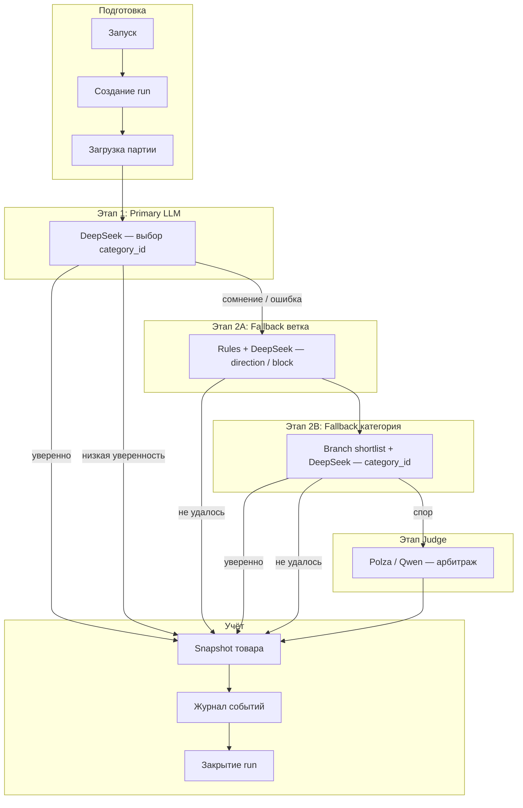

# Stage 2 — карта процесса и нод

Справочник для заказчика и команды. Технический контракт: [`stage2_workflow_contract.md`](stage2_workflow_contract.md).

**Workflow:** `classification-stage2-dev` на n8n  
**Стек:** n8n + PostgreSQL + DeepSeek (массовые раунды) + Polza / Qwen (арбитраж)

---

## Зачем этот pipeline

Система классифицирует аптечные товары **партиями**. Для каждой партии создаётся запуск (`run_id`) с итоговой статистикой и полным журналом решений.

Принцип: **уверенное решение фиксируется автоматически; сомнительное эскалируется** — на fallback, judge или (в будущем) человека в Telegram. Модель не «додумывает» категорию при низкой уверенности.

---

## Общая схема

---

## Маршрутизация по этапам

| Этап | Условие успеха | Порог confidence | Куда дальше |
|------|----------------|------------------|-------------|
| **P1** | Валидный JSON, category в shortlist | > 0.60 | Классифицирован → БД |
| **P1** | null / битый JSON / вне shortlist | — | Fallback 2A |
| **P1** | Валидный, но низкая уверенность | ≤ 0.60 | Human review → БД |
| **2A** | Валидная ветка в candidates | > 0.40 | Fallback 2B |
| **2A** | Иначе / нет кандидатов | — | Human review → БД |
| **2B** | category в branch shortlist, нет конфликта с P1 | > 0.60 | Классифицирован → БД |
| **2B** | Конфликт / low conf / null | — | Judge или human review |
| **Judge** | category в кандидатах | > 0.60 | Классифицирован → БД |
| **Judge** | Иначе | — | Human review → БД |

---

## Запись в базу данных

| Ситуация | Что пишется |
|----------|-------------|
| Товар **завершён** (classified / human_review) | Snapshot (`product_classification`) + log |
| Товар **идёт глубже** (fallback / judge) | Только log текущей стадии, item продолжает путь |
| Конец run | Обновление `classification_runs` (success_count, status, metadata) |

Товар, прошедший P1 → 2A → 2B → Judge, может дать **до 4 записей** в `product_classification_log` (по одной на стадию).

---

## LLM-модели на канвасе

| Нода | Этап | Модель | Зачем отдельная нода |
|------|------|--------|----------------------|
| **P1 — DeepSeek** | Primary | DeepSeek (`deepseek-v4-flash`) | Читаемость канваса |
| **2A — DeepSeek** | Fallback ветка | та же модель, тот же credential | Связь только с 2A Agent |
| **2B — DeepSeek** | Fallback категория | та же | Связь только с 2B Agent |
| **Shared — Polza** | Judge | `qwen/qwen3.5-flash-02-23@reasoning_effort=none` | Арбитраж спорных кейсов |

Все три DeepSeek-ноды указывают на **одну модель** — это осознанное правило для удобства чтения workflow, а не три разных API.

---

## Ноды по зонам

### Подготовка (In / Run / Load)

| Нода | Что делает |
|------|------------|
| **In — Manual** | Ручной запуск из UI n8n |
| **In — Webhook** | Внешний запуск POST-запросом |
| **In — Webhook Start** | Читает `batch_size` из body (1–100, по умолчанию 5) |
| **Run — Create Run** | Создаёт запись в `classification_runs`, возвращает `run_id` |
| **Run — Init Constants** | Прикладывает словарь констант: стадии, пороги, имена моделей |
| **Load — Select Batch** | Выбирает товары `pending` + primary shortlist; `LIMIT = batch_size` |
| **Load — Attach Run ID** | Добавляет каждому товару `run_id` и метаданные запуска |
| **Load — Limit Batch** | Страховочный лимит до `batch_size` (на случай рассинхрона SQL) |

---

### P1 — Primary LLM (основной раунд)

| Нода | Что делает |
|------|------------|
| **P1 — Build Prompt** | Собирает текст промпта: описание товара, shortlist, политика выбора |
| **P1 — LLM Prepare** | Готовит поля для AI Agent; дублирует item в Agent и Merge |
| **P1 — AI Agent** | Вызывает LLM; ожидает JSON: `category_id`, `confidence`, `explanation` |
| **P1 — DeepSeek** | Chat Model для P1 Agent |
| **P1 — Merge LLM** | Склеивает исходный контекст товара с ответом модели |
| **P1 — Post-process** | Парсит JSON, валидирует, считает `llm_*`, решает `next_action` |
| **P1 — Route** | `fallback_2a` → этап 2A; classified / human_review → запись в БД |

**Выход LLM:** конкретный `category_id` (или null).

---

### 2A — Fallback ветка (направление в дереве категорий)

| Нода | Что делает |
|------|------------|
| **2A — Categories Trigger** | Запускает параллельную загрузку справочника категорий |
| **2A — Load Categories** | Читает `categories_dict` (активные категории) |
| **2A — Merge Context** | Объединяет товары и справочник в один поток |
| **2A — Rule Branch Filter** | Rule-scoring: top-8 кандидатов веток (`direction`, `block_family`, `family_code`) |
| **2A — Skip LLM?** | Если кандидатов нет — пропуск LLM, сразу Post-process |
| **2A — LLM Prepare** | Промпт: выбрать **ветку**, не финальный `category_id` |
| **2A — AI Agent** | JSON: direction, block_family, family_code, nosology_hint, confidence, explanation |
| **2A — DeepSeek** | Chat Model для 2A Agent |
| **2A — Merge LLM** | Context + ответ LLM |
| **2A — Post-process** | Валидация ветки; routing → 2B или human review |

**Выход LLM:** ветка каталога, **без** `category_id`.

---

### 2B — Fallback категория (выбор category_id внутри ветки)

| Нода | Что делает |
|------|------------|
| **2B — Route** | `fallback_2b` → цепочка 2B; human_review после 2A → БД |
| **2B — Categories Trigger** | Отдельная загрузка справочника (независимо от 2A) |
| **2B — Load Categories** | `categories_dict` |
| **2B — Merge Context** | Товары + справочник |
| **2B — Branch Shortlist Builder** | Строит узкий shortlist категорий внутри ветки 2A |
| **2B — Prepare Shortlist Payload** | Готовит данные для таблицы `classification_shortlist` |
| **2B — Insert Branch Shortlist** | Сохраняет branch shortlist в БД |
| **2B — Skip LLM?** | Пропуск LLM при пустом shortlist |
| **2B — LLM Prepare** | Промпт: `category_id` **строго** из branch shortlist |
| **2B — AI Agent** | JSON: category_id, confidence, explanation |
| **2B — DeepSeek** | Chat Model для 2B Agent |
| **2B — Merge LLM** | Context + ответ LLM |
| **2B — Post-process** | Валидация; проверка конфликта с P1; routing → classified / judge / review |

**Выход LLM:** `category_id` только из branch shortlist.

---

### Judge — арбитраж (Polza / Qwen)

| Нода | Что делает |
|------|------------|
| **Judge — Route** | `judge` → цепочка Judge; иначе → БД |
| **Judge — LLM Prepare** | Сводный промпт: результаты P1, 2A, 2B + оба shortlist + контекст спора |
| **Judge — AI Agent** | JSON: winner_source, category_id, confidence, explanation, needs_human_review |
| **Shared — Polza** | Chat Model для Judge (отдельная от DeepSeek) |
| **Judge — Merge LLM** | Context + ответ Judge |
| **Judge — Post-process** | Финальное решение → запись в БД |

**Когда вызывается:** конфликт P1 vs 2B, низкая уверенность 2B, category вне shortlist.

---

### DB + Fin — учёт и закрытие run

| Нода | Что делает |
|------|------------|
| **DB — Prepare Snapshot** | Нормализует поля → объект для upsert в `product_classification` |
| **DB — Prepare Log** | Формирует запись event log для `product_classification_log` |
| **DB — Upsert Snapshot** | INSERT … ON CONFLICT UPDATE — одна строка на товар |
| **DB — Insert Log** | Append-only журнал попыток по стадиям |
| **Fin — Merge Barrier** | Ждёт завершения и snapshot, и log по каждому товару |
| **Fin — Pick Run** | Оставляет один item с id запуска |
| **Fin — Close Run** | Агрегирует статистику, закрывает `classification_runs` |

---

## Что несёт товар через pipeline

Каждый товар — один **item** с нарастающим набором полей:

| Группа полей | Когда появляется |
|--------------|------------------|
| `run_id`, `constants`, `shortlist_json`, `combined_text` | После Load |
| `llm_*` | После P1 |
| `fallback_2a_*`, `branch_candidates_json` | После 2A |
| `fallback_2b_*`, `branch_shortlist_json` | После 2B |
| `judge_*` | После Judge |
| `decision_status`, `next_action`, `final_*` | После каждого Post-process |

---

## Что дальше (не в этом workflow)

- **Human review через Telegram** — карточки для товаров с `needs_human_review`
- **Policy borderline** — кейсы с confidence 0.40–0.60 сначала в fallback, а не сразу на ревью

---

## Связанные документы

| Документ | Содержание |
|----------|------------|
| [`stage2_workflow_contract.md`](stage2_workflow_contract.md) | Контракт для разработки |
| [`stage2_workflow_plan.md`](stage2_workflow_plan.md) | Журнал выполненных фаз |
| [`stage2_project_description.md`](stage2_project_description.md) | Бизнес-описание этапов |
| [`PROJECT.md`](PROJECT.md) | Обзор репозитория |
