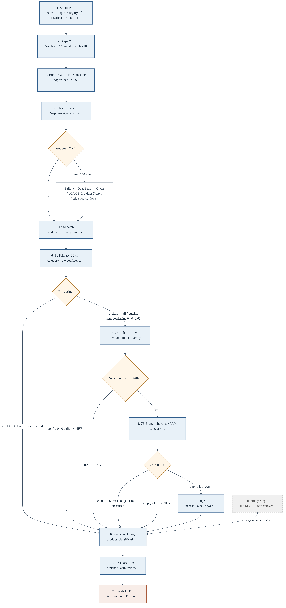

# Схема пайплайна классификации (MVP)

Дата: 2026-09-21  
Канон: [`classification-scheme-prompts.md`](classification-scheme-prompts.md), [`project-context.md`](project-context.md)

## Картинка

| Формат | Файл |
|--------|------|
| PNG (снимок) | [`media/classification-pipeline-diagram.png`](media/classification-pipeline-diagram.png) |
| **draw.io** (редактируемая схема) | [`classification-pipeline.drawio`](classification-pipeline.drawio) — открыть в [diagrams.net](https://app.diagrams.net) · [Drive](https://drive.google.com/file/d/1NTQuLSgyh-vODat6URQmr2kX2VJQ_3N7/view?usp=drivesdk) |

Схема draw.io: MVP-flow ShortList → … → Sheets HITL, decision diamonds для Healthcheck / P1 / 2A / 2B, Hierarchy пунктиром **вне cutover**.

## Порядок (MVP)

1. **ShortList** — rules → top-5 `category_id` (`classification_shortlist`)
2. **Stage 2 In** — webhook / manual, batch ≤ 10
3. **Run Create + Init Constants** — пороги **0.40 / 0.60**
4. **Healthcheck** — probe DeepSeek Agent → иначе **Qwen** failover
5. **Load** — pending + primary shortlist
6. **P1** Primary LLM → routing по confidence
7. **2A** Rules + LLM (ветка direction/block/family)
8. **2B** Branch shortlist + LLM (`category_id`)
9. **Judge** — всегда Polza/Qwen (арбитраж)
10. **Snapshot + Log** → `product_classification` / log
11. **Fin** Close Run (`finished_with_review`)
12. **Sheets HITL** — `A_classified` / `B_open`

## Routing (пороги)

| Этап | Условие | Результат |
|------|---------|-----------|
| P1 | conf **> 0.60** valid | `classified` → DB |
| P1 | conf **≤ 0.40** valid | `needs_human_review` → DB |
| P1 | broken / null / outside / **(0.40, 0.60]** | → 2A |
| 2A | ветка conf **> 0.40** | → 2B |
| 2A | иначе | NHR → DB |
| 2B | conf **> 0.60** без конфликта | `classified` → DB |
| 2B | спор / low conf | → Judge |
| 2B | empty / fail | NHR → DB |
| Judge | всегда | → DB |

## Failover LLM

Healthcheck перед каждым chunk: DeepSeek Agent OK → `llm_provider=deepseek`; иначе **Qwen/Polza**.  
P1 / 2A / 2B переключаются Provider Switch. **Judge всегда Qwen** (не зависит от healthcheck).

## Не MVP

**Hierarchy** (`classification-stage2-hierarchy-dev`) — на схеме пунктиром, **не** в cutover пилота.

## Workflow ids (live)

| Workflow | Id |
|----------|-----|
| ShortList | `7hx7k2mhJCbA57BG` |
| classification-llm-healthcheck | `AS3d7jZXevM1K3n5` |
| classification-stage2-dev | `BaBjEPi78taRj2G5` |
| classification-batch-acceptance | `iQo3b3VdmTlGdhbj` |
