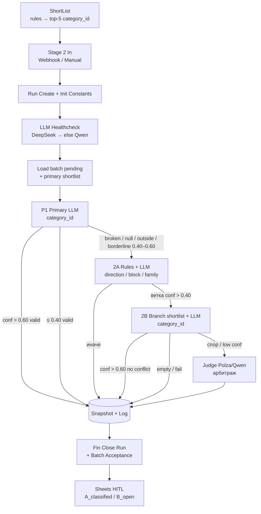

# Схема классификации и промпты агентов (MVP)

Документ фиксирует **текущую** схему: на каком этапе какие модули решают, как идёт routing, какие модели и **полные** system/user-промпты.

| Поле | Значение |
|------|----------|
| Дата снимка | **2026-09-20** |
| Канон Stage 2 | live `classification-stage2-dev` |
| Workflow id | `BaBjEPi78taRj2G5` |
| versionId | `24700c80-d96c-4a99-9e66-649cd8b1e5a6` |
| updatedAt (live) | `2026-09-20T10:44:57.651Z` |
| active | `true` |
| Источник | **снято с live n8n API** (`GET /api/v1/workflows/BaBjEPi78taRj2G5`); в этом snapshot `workflows/classification-stage2-dev.json` **синхронизирован** с live (**73** ноды: healthcheck / Provider Switch / Qwen-агенты) |
| Healthcheck | live `classification-llm-healthcheck` `AS3d7jZXevM1K3n5`, active, updated `2026-09-20T10:24:32.509Z` |
| ShortList | live `ShortList` `7hx7k2mhJCbA57BG` (**inactive** на момент снимка; в пилоте включается точечно) |
| HITL | Sheets через `classification-batch-acceptance` `iQo3b3VdmTlGdhbj` (после Fin) |

**Не в MVP:** `classification-stage2-hierarchy-dev` — параллельный redesign, в cutover пилота не входит.

Пороги (из `Run — Init Constants`): `0.40` / `0.60` (borderline / auto-ok). Принцип: уверенное — auto-close; сомнительное — эскалация, без «додумывания».

---

## 1. Обзор пайплайна



**Кто решает по этапам (кратко):**

| Этап | Решает |
|------|--------|
| ShortList | **rules** (JS scoring) |
| Healthcheck | **system** probe LLM |
| P1 / 2A / 2B | **LLM** (+ rules перед 2A/2B) |
| Judge | **LLM** (всегда Polza/Qwen) |
| Sheets HITL | **human** |
| Fin / snapshot / log | **system** (без промптов) |

---

## 2. ShortList (Stage 1, до Stage 2)

| | |
|--|--|
| Workflow | `ShortList` (`7hx7k2mhJCbA57BG`) |
| Модули/ноды | `Товары`, `категории`, `Merge`, `Code in JavaScript`, SQL upsert shortlist + snapshot/log stubs |
| Кто решает | **rules** (без LLM) |
| Вход | Сырой/нормализованный товар + `categories_dict` |
| Выход | `shortlist` top-**5**, `top_category_id`, `top_score`, `product_type_guess`, `combined_text` → таблица `classification_shortlist` (`stage=primary_rules`) |
| Промпт | **нет** |

Скоринг (суть code-ноды): нормализация текста, эвристики типа товара / route / age, совпадения по коду/названию/нозологии/MNN/keywords; без «сильного» match score обнуляется; берётся top-5.

Stage 2 `Load — Select Batch` берёт товары `pending` **с уже готовым** primary shortlist.

---

## 3. Setup Stage 2 + healthcheck перед chunk

### 3.1 Setup-ноды

| Нода | Роль |
|------|------|
| `In — Webhook` / `In — Webhook Start` | POST; `batch_size` 1–10 (default 5) |
| `In — Manual` | ручной старт |
| `Run — Create Run` | INSERT `classification_runs` → `run_id` |
| `Run — Init Constants` | пороги, имена стадий, модели-ярлыки |
| `Run — LLM Healthcheck` | Execute Workflow → `AS3d7jZXevM1K3n5` |
| `Run — Apply LLM Provider` | пишет `llm_provider` ∈ `{deepseek,qwen}` в constants; иначе **throw** |
| `Load — Select Batch` / `Attach Run ID` / `Limit Batch` | партия + проброс `llm_provider` / `llm_model` на каждый item |

Порядок: `Create Run` → `Init Constants` → **Healthcheck** → **Apply Provider** → Load → P1.

### 3.2 Healthcheck (`classification-llm-healthcheck`)

| | |
|--|--|
| Кто решает | **system** + probe LLM |
| Вход | Execute Workflow из Stage 2 (или webhook `classification-llm-healthcheck`) |
| Routing | DeepSeek Agent OK → `llm_provider=deepseek`; иначе Qwen/Polza; оба fail → `ok=false` |

**Модели probe:** DeepSeek `deepseek-v4-flash`; Qwen `qwen/qwen3.5-flash-02-23@reasoning_effort=none` (Polza).

#### System

```text
Reply with exactly the word OK. No other text.
```

#### User

```text
healthcheck
```

Критерий DeepSeek OK: непустой ответ агента **и** нет признаков geo/403 (`forbidden`, `country`, `region`, …). На AdminVPS DeepSeek LangChain Agent часто **403 geo** → Stage 2 идёт через **Qwen** (подтверждено failover-доками пилота).

`Load — Attach Run ID` копирует `llm_provider` на item → `P1/2A/2B — Provider Switch`: `qwen` → `*— AI Agent Qwen` + `*— Polza`; иначе → `*— AI Agent` + `Shared — DeepSeek*`.

**Judge всегда на `Shared — Polza` (Qwen)** — не переключается healthcheck’ом.

---

## 4. P1 — Primary LLM

| | |
|--|--|
| Ноды | `P1 — Build Prompt` → `LLM Prepare` → `Provider Switch` → `AI Agent` **или** `AI Agent Qwen` → `Merge LLM` → `Post-process` → `Route` |
| Кто решает | **LLM** (+ политика shortlist из rules) |
| Модель | DeepSeek `deepseek-v4-flash` **или** Qwen `qwen/…@reasoning_effort=none` (после healthcheck) |
| prompt_version | `prompt_primary_llm_v1` (константы стадий; system/user из Build Prompt) |
| JSON | `category_id`, `confidence`, `explanation` |

### Routing (`P1 — Post-process` / `P1 — Route`)

| Условие | decision_status | next_action |
|---------|-----------------|-------------|
| valid, conf **> 0.60** | `classified` | `none` → DB |
| invalid / null / outside shortlist / broken | `pending_fallback` | `fallback_2a` |
| valid, conf в **(0.40, 0.60]** | `pending_fallback` | `fallback_2a` |
| valid, conf **≤ 0.40** | `needs_human_review` | `human_review` → DB |

### System

```text
You classify pharmacy products into one category. Return ONLY a valid JSON object with keys: category_id, confidence, explanation.
```

### User (шаблон из `P1 — Build Prompt`)

```text
Товар (нормализованный текст):
${j.combined_text}

Тип товара по эвристике: ${j.product_type_guess}

Shortlist кандидатов категорий:
${shortlistText}

${ruleHint}

${shortlistPolicyText}

Задача:
- Выбери наиболее подходящую категорию для товара.
- Верни category_id, confidence и explanation.
- confidence должен быть числом от 0.0 до 1.0.
- explanation должен быть кратким, на русском, 1–3 предложения.
- Не добавляй комментарии вне JSON.
```

`shortlistText` — нумерованный список `id / code / name / score / reasons`, либо `EMPTY`.

`ruleHint`:

- `Rule engine suggests category_id=… as top candidate with score=….`
- или `Rule engine has no strong suggestion.`

#### Варианты `${shortlistPolicyText}`

**A.** shortlist пуст или `rule_top_score < 10`:

```text
Политика выбора:
- Shortlist пустой или низкоуверенный.
- Рассматривай shortlist как слабую подсказку, а не как ограничение.
- Если видишь более подходящую категорию вне shortlist, можешь выбрать её.
- Если уверенно выбрать нельзя, верни category_id = null и в объяснении укажи, что нужен review.
```

**B.** `rule_top_score ≥ 20`:

```text
Политика выбора:
- Rule-based слой дал сильный top candidate.
- В первую очередь проверь, подходит ли top candidate.
- Если top candidate не подходит, выбери лучшую категорию из shortlist.
- Если ни одна категория не подходит, верни category_id = null и укажи причину.
```

**C.** `10 ≤ rule_top_score < 20`:

```text
Политика выбора:
- Shortlist выглядит разумным, но не окончательным.
- Предпочитай выбор из shortlist.
- Если ни один кандидат не подходит, можешь выбрать категорию вне shortlist или вернуть category_id = null.
- Если выбор вне shortlist, кратко объясни почему shortlist оказался недостаточным.
```

Агенты (`P1 — AI Agent` / `P1 — AI Agent Qwen`): `systemMessage = {{ $json.prompt_system }}`, text = `{{ $json.prompt_user }}` (после `P1 — LLM Prepare`).

---

## 5. 2A — Fallback ветка

| | |
|--|--|
| Ноды | `Categories Trigger` ∥ `Load Categories` → `Merge Context` → **`Rule Branch Filter`** (rules top-8 веток) → `Skip LLM?` → `LLM Prepare` → Provider Switch → Agent → Merge → `Post-process` → `2B — Route` |
| Кто решает | **rules** (кандидаты) + **LLM** (выбор ветки); при 0 кандидатов — skip LLM |
| Модель | DeepSeek или Qwen (как P1) |
| prompt_version | `prompt_fallback_2a_v1` |
| JSON | `direction`, `block_family`, `family_code`, `nosology_hint`, `confidence`, `explanation` (**без** `category_id`) |

### Routing

| Условие | next_action |
|---------|-------------|
| ветка в candidates, conf **> 0.40** | `fallback_2b` |
| иначе / нет кандидатов / invalid | `human_review` → DB |

### System

```text
You select a pharmacy product branch (direction/block/family), NOT a final category_id. Return ONLY a valid JSON object with keys: direction, block_family, family_code, nosology_hint, confidence, explanation.
```

### User (шаблон из `2A — LLM Prepare`)

```text
Товар (нормализованный текст):
${j.combined_text}

Тип товара по эвристике: ${j.product_type_guess}

Контекст неудачи primary LLM:
${JSON.stringify(primaryFailureContext, null, 2)}

Branch-кандидаты (выбери один):
${candidatesText}

Задача:
- Выбери наиболее подходящую ветку (direction, block_family, family_code).
- nosology_hint — опциональная подсказка по нозологии, если уместно.
- confidence — число от 0.0 до 1.0.
- explanation — кратко на русском, 1–3 предложения.
- НЕ возвращай category_id.
- Не добавляй комментарии вне JSON.
```

`primaryFailureContext` включает `llm_category_id`, `llm_confidence`, `llm_explanation`, `llm_reject_reason`, `llm_validation_passed`, `rule_top_*`, `shortlist_count`, `routing_hint`.

`candidatesText`: строки `direction / block_family / family_code / score / sample / reasons`, либо `EMPTY` (тогда `skip_llm`, промпты пустые).

---

## 6. 2B — Fallback категория в ветке

| | |
|--|--|
| Ноды | `2B — Route` → Categories ∥ Load → Merge → **`Branch Shortlist Builder`** (rules) → Prepare/Insert shortlist → `Skip LLM?` → `LLM Prepare` → Provider Switch → Agent → Merge → `Post-process` → `Judge — Route` |
| Кто решает | **rules** (branch shortlist) + **LLM** |
| Модель | DeepSeek или Qwen (как P1) |
| prompt_version | `prompt_fallback_2b_v1` |
| JSON | `category_id`, `confidence`, `explanation` — **строго из branch shortlist** |

### Routing (суть)

| Условие | Итог |
|---------|------|
| valid, conf **> 0.60**, нет конфликта с P1 | `classified`, `final_source=fallback_2b` |
| конфликт P1 vs 2B / low conf / вне shortlist | чаще `judge` |
| пустой branch shortlist / hard fail | `human_review` |

### System

```text
You classify pharmacy products into one category within a pre-selected branch. Return ONLY valid JSON with keys: category_id, confidence, explanation. category_id MUST be from the branch shortlist.
```

### User (шаблон из `2B — LLM Prepare`)

```text
Товар:
${j.combined_text}

Тип товара: ${j.product_type_guess}

Выбранная ветка (fallback 2A):
${JSON.stringify(branchContext, null, 2)}

Контекст неудачи primary LLM:
${JSON.stringify(primaryContext, null, 2)}

Branch shortlist (выбери ОДНУ категорию ТОЛЬКО из списка):
${shortlistText}

Политика:
- category_id ОБЯЗАН быть из shortlist выше.
- Если ни одна категория не подходит — верни category_id=null и объясни.
- confidence: 0.0–1.0; explanation: 1–3 предложения на русском.
- Только JSON, без комментариев.
```

`branchContext`: direction / block_family / family_code / nosology_hint / conf / explanation 2A.  
Пустой shortlist → `skip_llm`.

---

## 7. Judge — арбитраж

| | |
|--|--|
| Ноды | `Judge — Route` → `LLM Prepare` → `AI Agent` ← **`Shared — Polza`** → Merge → `Post-process` → DB |
| Кто решает | **LLM** |
| Модель | **всегда** Polza / Qwen `qwen/qwen3.5-flash-02-23@reasoning_effort=none` (json_object, temperature 0.2) |
| prompt_version | `prompt_judge_v1` |
| JSON | `winner_source` (`llm` \| `fallback_2b` \| `none`), `category_id`, `confidence`, `explanation`, `needs_human_review` |

### Routing

| Условие | Итог |
|---------|------|
| valid, conf **> 0.60**, category в кандидатах, не forced review | `classified`, `final_source=judge` |
| иначе | `needs_human_review` |

### System

```text
You are a senior pharmacy product classification judge. Review prior automated rounds and return ONLY valid JSON with keys: winner_source, category_id, confidence, explanation, needs_human_review. winner_source must be one of: llm, fallback_2b, none. category_id must be from the allowed candidate ids or null if none fits.
```

### User (шаблон из `Judge — LLM Prepare`)

```text
Товар:
${j.combined_text}

Тип товара: ${j.product_type_guess}
run_id: ${j.run_id}

Primary LLM (P1):
${JSON.stringify(primaryRound, null, 2)}

Fallback 2A (ветка):
${JSON.stringify(fallback2a, null, 2)}

Fallback 2B (категория в ветке):
${JSON.stringify(fallback2b, null, 2)}

Контекст спора:
${JSON.stringify(disputeContext, null, 2)}

Rule shortlist (primary):
${formatShortlist(ruleShortlist)}

Branch shortlist (fallback 2B):
${formatShortlist(branchShortlist)}

Задача:
- Выбери финальную category_id из объединения shortlist-ов выше, либо null если ни одна не подходит.
- winner_source: чей ответ вы предпочитаете (llm | fallback_2b | none).
- confidence: 0.0–1.0; explanation: 1–3 предложения на русском.
- needs_human_review=true если уверенность низкая или кандидаты противоречивы.
- Верни только JSON без markdown.
```

---

## 8. Sheets HITL (человек)

| | |
|--|--|
| Триггер | `Fin — Batch Acceptance` → `classification-batch-acceptance` |
| Кто решает | **human** |
| Промпт | **нет** |
| Артефакты | Spreadsheet на `run_id`: лист **A_classified** (auto), **B_open** (`needs_human_review` / error) |
| Telegram | ops-уведомление со ссылками (не primary HITL); Telegram enqueue/send HITL-карточек — неактивен |

Writeback эксперта: `final_source=human` (контракт приёмки / human review).

---

## 9. Fin / snapshot / log (без промптов)

| Нода | Назначение |
|------|------------|
| `DB — Prepare Snapshot` / `Upsert Snapshot` | одна строка `product_classification` на товар |
| `DB — Prepare Log` / `Insert Log` | append-only `product_classification_log` по стадиям |
| `Fin — Merge Barrier` | ждёт snapshot+log |
| `Fin — Pick Run` / `Close Run` | закрытие `classification_runs` (счётчики, `finished_at`) |
| `Fin — Batch Acceptance` | экспорт Sheets + balances |

Товар, ушедший P1→2A→2B→Judge, может дать до **4** log-записей. На промежуточных шагах (ещё идёт глубже) пишется в основном log стадии; финальный snapshot — при терминальном решении.

---

## 10. Сводка моделей (live wiring)

| Этап | Provider path | Модель |
|------|---------------|--------|
| Healthcheck primary | DeepSeek LM | `deepseek-v4-flash` |
| Healthcheck fallback | Polza | `qwen/qwen3.5-flash-02-23@reasoning_effort=none` |
| P1 / 2A / 2B | DeepSeek Agents **или** Qwen Agents | то же, по `llm_provider` |
| Judge | Shared — Polza | Qwen flash `@reasoning_effort=none` |

Ярлыки в constants (`deepseek-chat` / `qwen/qwen3.5-flash-02-23`) — для логов/actor_name; фактические Chat Model nodes — как в таблице выше.

---

## Связанные каноны

- Репо: `Categories/stage2_workflow_contract.md`, `stage2_node_map.md`, `category_recognition_customer.md`, `batch_acceptance_contract.md`, `PROJECT.md`
- Store: `docs/project-context.md`, `docs/llm-failover-deepseek-qwen.md`, `docs/pilot-200-report.md`
