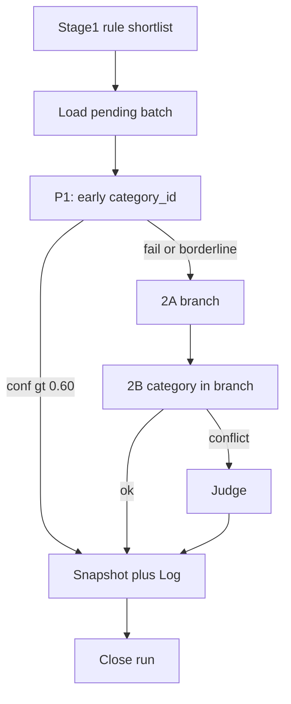
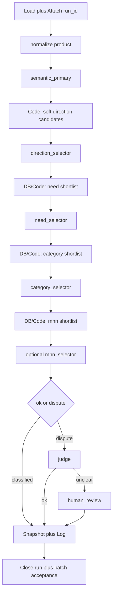
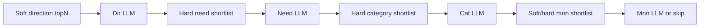

# Full migration plan: semantic-first hierarchy cascade

Status: **plan only** — no implementation until confirmed.  
Workflow target: clone `classification-stage2-hierarchy-dev` (do not modify prod `classification-stage2-dev`).  
Date context: 2026-07-20.

Related docs:
- [`10_PROJECT_CONTEXT.md`](10_PROJECT_CONTEXT.md)
- [`11_CURRENT_WORKFLOW_SUMMARY.md`](11_CURRENT_WORKFLOW_SUMMARY.md)
- [`12_REDESIGN_TARGET.md`](12_REDESIGN_TARGET.md)
- [`../Categories/stage2_workflow_contract.md`](../Categories/stage2_workflow_contract.md)
- Canonical workflow: [`../workflows/classification-stage2-dev.json`](../workflows/classification-stage2-dev.json)

---

## 0. Locked defaults

| Decision | Choice |
|----------|--------|
| Migration style | New workflow clone; prod Stage 2 untouched |
| Hierarchy v1 | Text axes from `categories_dict` (no new ID tables yet) |
| Mapping | Направление=`direction`, Потребность=`need_nosology`, Категория=`id`, МНН=`mnn_cluster` — **live-confirmed with caveats** ([`21b_MAPPING_STATS.md`](21b_MAPPING_STATS.md), [`21_HIERARCHY_MAPPING_SAMPLES.md`](21_HIERARCHY_MAPPING_SAMPLES.md)) |
| Stage 1 role | Eligibility + soft hint only; never hard-constrain `semantic_primary` |
| Sem validation fail | Soft-continue with `validation_passed=false` (do not hard-stop cascade) |
| `decision_status` intermediate | **Reuse historical `pending_fallback`** — see §2.1 |
| Snapshot policy | **Terminal-only** — see §2.2 |
| Human review (v1) | **Sheets batch acceptance = primary path; Telegram optional/inactive** — see §2.3 |
| Cutover | Only after Sem validation 100→500→1000 and cascade smoke; dual-run compare before any prod switch |

Preserve always:
- `classification_runs`, single `run_id` per run
- `product_classification.latest_run_id`
- `product_classification_log.run_id`
- Code pattern `...item.json` + `pairedItem`
- Post-processing after every LLM stage
- Raw + validated logging
- `workflow_version` + `prompt_version` on every stage write

---

## 1. Current architecture (brief)



Main weakness: early leaf `category_id` before semantic understanding and before hierarchy cascade.

---

## 2. Target architecture overview



**run_type:** `stage2_hierarchy_v1`  
**workflow_version base:** `stage2_hierarchy_v1`  
**Item invariant:** every Code node returns `{ json: { ...item.json, ... }, pairedItem }`

### 2.1 `decision_status` policy (v1 locked)

**Choice:** reuse historical `pending_fallback` as the **only** technical intermediate status. Do **not** introduce a new DB enum value (e.g. `pending_cascade` / `pending_next_stage`) in v1.

| `decision_status` | When used in hierarchy-cascade |
|-------------------|--------------------------------|
| `pending_fallback` | Item accepted current stage and is advancing to the next hierarchy stage (Sem→Dir→Need→Cat→Mnn→Judge). Also used for mid-path escalate to Judge when not yet terminal. |
| `classified` | Terminal success only |
| `needs_human_review` | Terminal human path only |
| `error` | Terminal hard failure only |

**Semantics in this branch:** `pending_fallback` means “pending next hierarchy stage / pending judge”, not “legacy 2A/2B fallback”. Precise next hop is always in `next_action` (`direction_select`, `need_shortlist`, `category_select`, `mnn_shortlist`, `judge`, `human_review`, `none`).

**Why not a new status in v1:** avoids CHECK/constraint migrations and keeps Fin/Close Run / eligibility queries compatible with existing Stage 2 tooling. A rename to a clearer label (e.g. `pending_cascade`) is explicitly deferred to a later schema cleanup after cascade validation — not part of v1 implementation.

**Forbidden in v1:** writing `classified` before the terminal stage for that item; inventing new `decision_status` strings without a planned migration.

### 2.2 Snapshot policy (v1 locked)

**Choice: snapshot only on terminal stages.**

| Outcome | Snapshot upsert | Event log insert |
|---------|-----------------|------------------|
| Intermediate advance (`decision_status=pending_fallback`) | **No** | **Yes** — current stage |
| Skip-LLM system select (still intermediate) | **No** | **Yes** — `actor_type=system` |
| Terminal `classified` | **Yes** | **Yes** |
| Terminal `needs_human_review` | **Yes** | **Yes** |
| Terminal `error` | **Yes** | **Yes** |

**Implications:**
- Mid-cascade accepted fields (`semantic_attrs`, `selected_direction`, …) live on the **n8n item** and in **`product_classification_log` payloads** until terminal write.
- Terminal snapshot writes the full cascade result in one upsert (`selected_*`, `semantic_*`, `cascade_trace`, `final_*`, `latest_run_id`, versions).
- No “partial snapshot after each accepted hierarchy stage” in v1 (avoids half-updated `product_classification` rows and race reads against prod Stage 2).

**Not v1:** progressive snapshot after Dir/Need/Cat. If observability requires it later, treat as a separate change with explicit read-model rules.

### 2.3 Human review v1 (temporary, conscious)

**Primary path (v1):** Sheets **batch acceptance** via `Fin — Batch Acceptance` (same operational pattern as current Stage 2).

**Not in v1 activation scope:** Telegram HITL workflows (`classification-human-review-enqueue` / `send` / `callback`) remain **optional and inactive**. Do not wire hierarchy terminal human cases to Telegram as a required dependency.

**Terminal item contract when human needed:**
- `decision_status = needs_human_review`
- `next_action = human_review`
- `final_source = system` (pending human resolution)
- one terminal snapshot + log (per §2.2)

**Why temporary:** reuse proven ops path; avoid reactivating inactive Telegram stack before cascade quality is proven. Enabling Telegram HITL is a **separate later stage**, not a v1 blocker and not a v1 deliverable.

### 2.4 Write policy summary

| Outcome | Snapshot | Log |
|---------|----------|-----|
| Escalate / intermediate (`pending_fallback`) | no | yes — current stage |
| Terminal classified / needs_human_review / error | yes | yes |
| Skip-LLM bypass (intermediate) | no | yes — `actor_type=system` |
| Skip-LLM that completes terminal classify | yes | yes |

---

## 3. Target architecture by stage

For each stage below: purpose, inputs, output JSON, routing, and adjacent shortlist stages.

Threshold constants (initial; calibrate after Sem validation):

| Key | Value | Use |
|-----|-------|-----|
| `min_soft_ok` | 0.50 | direction / need / mnn auto-advance |
| `min_category_ok` | 0.60 | category auto-classify |
| `min_judge_ok` | 0.60 | judge auto-classify |
| `borderline_low` | 0.40 | ≤ → human_review (when valid) |
| `direction_soft_top_n` | 8 | soft direction candidates |
| `need_hard_top_n` | 12 | needs in direction |
| `category_hard_top_n` | 10 | categories in need |
| `mnn_soft_top_n` | 8 | mnn under category |

---

### 3.1 `normalize` (Norm — Code only)

**Purpose:** single composition of product text + prep fields before any LLM. No category choice.

**Inputs (from Load):**
- `product_id`, `product_raw_id`, `run_id`, `constants`
- `combined_text` (from Stage 1 shortlist join) and/or raw name fields from load SQL
- optional Stage 1: `shortlist_json`, `rule_top_category_id`, `rule_top_score`, `rule_decision_status`
- preferred (extend Load SQL): `brand_guess`, `form_guess`, `dosage_guess`, `pack_size_guess`, `product_type_guess`

**Outputs (item fields):**
- `normalized_text`
- `normalize_meta` `{ source_fields, truncated, empty_flags }`
- `workflow_version`, `prompt_version` not required (no LLM); log optional

**JSON contract:** none (Code-only).

**Routing:** always → `semantic_primary`.

**Shortlist:** none.

---

### 3.2 `semantic_primary` (Sem — LLM)

**Purpose:** extract semantic attributes only. **Must not** return `category_id`, direction, need, or final leaf.

**Inputs:**
- `normalized_text`, prep guesses, `product_type_guess`
- soft hint only: compact `rule_shortlist_hint` (top names/codes, not as mandatory set)
- `run_id`, `constants`

**Output JSON contract:**

```json
{
  "mnn": "string|null",
  "brand": "string|null",
  "rx_otc": "rx|otc|unknown|null",
  "nosology": "string|null",
  "administration_route": "string|null",
  "dosage_form": "string|null",
  "dosage": "string|null",
  "age_segment": "string|null",
  "package_hint": "string|null",
  "combination_hint": "string|null",
  "confidence": 0.0,
  "explanation": "string"
}
```

**Post-process writes (item):**
- `semantic_attrs`, `semantic_confidence`, `semantic_explanation`
- `semantic_raw_json`, `semantic_validation_passed`, `semantic_reject_reason`
- `workflow_version=stage2_hierarchy_v1`, `prompt_version=prompt_semantic_v1`
- log `stage=semantic_primary`

**Routing:**

| Condition | `decision_status` | `next_action` |
|-----------|-------------------|---------------|
| Parsed OK (even if many nulls) | `pending_fallback` | `direction_select` |
| Invalid JSON / empty output | `pending_fallback` | `direction_select` + `semantic_validation_passed=false` (soft-continue) |
| Missing explanation only | same soft-continue | `direction_select` |

Never route Sem → `classified`. Never lock branch here.

**Shortlist between Norm and Sem:** none.

**Shortlist after Sem (before Dir):** Code soft direction candidates (see 3.3) — not persisted as hard lock.

---

### 3.3 Soft direction candidates (Code, pre-`direction_selector`)

**Purpose:** build soft candidate list without locking.

**How:**
1. Load active `categories_dict` (Merge Context pattern, same as 2A today).
2. Score DISTINCT `direction` using `semantic_attrs` + `normalized_text` + optional rule shortlist category→direction votes.
3. Emit `direction_candidates_json` top-N (`direction_soft_top_n`), each: `{ rank, direction, score, reasons[] }`.
4. Also emit `direction_universe` = full DISTINCT active directions (for soft-to-hard policy).

**Persist?** Optional log-only; **do not** write `classification_shortlist` yet (avoid false “chosen branch” audit). If persist desired for debug: `stage=direction_candidates`, `shortlist_type=soft_direction`, no parent lock.

**Routing:** always → `direction_selector` (Skip-LLM if exactly 1 candidate with score ≥ threshold — still record system selection).

---

### 3.4 `direction_selector` (Dir — LLM)

**Purpose:** choose Направление. Soft-to-hard: prefer soft candidates; allow `null`/`unknown`; allow out-of-soft only with explicit flag and only if post-process finds it in `direction_universe`.

**Inputs:**
- `semantic_attrs`, `normalized_text`
- `direction_candidates_json` (soft)
- `direction_universe` (hard ceiling for v1)
- rule hint (optional)

**Output JSON contract:**

```json
{
  "selected": "string|null",
  "confidence": 0.0,
  "explanation": "string",
  "unknown": false,
  "outside_soft_list": false
}
```

**Post-process:**
- Normalize `selected` text (trim, case-fold compare to universe).
- If `unknown=true` or `selected=null` → no lock.
- If `selected` ∈ soft list → accept path.
- If `selected` ∉ soft but ∈ universe and `outside_soft_list=true` → accept with `routing_hint.soft_override=true` (anti-lock-in escape).
- If `selected` ∉ universe → reject `direction_outside_universe`.
- Write: `selected_direction`, `direction_confidence`, `direction_raw_json`, `direction_validation_passed`, versions `prompt_direction_v1`.

**Routing:**

| Condition | `next_action` |
|-----------|---------------|
| valid + conf > `min_soft_ok` + selected set | `need_shortlist` → need_selector path |
| valid + conf in (`borderline_low`, `min_soft_ok`] | `judge` (early) **or** `need_shortlist` with wider soft fill — **v1 choice: widen soft fill once, then continue**; if still weak → `judge` |
| valid + conf ≤ `borderline_low` | `human_review` |
| invalid / outside universe | `human_review` |
| null/unknown | `human_review` (cannot cascade without direction in v1) |

**Shortlist after Dir:** DB/Code **need_in_direction** (hard children).

---

### 3.5 Need shortlist builder (DB/Code)

**Stage key:** `classification_shortlist.stage = need_in_direction`  
**shortlist_type:** `need_shortlist`  
**parent_stage:** `direction_select`

**Logic:**
```text
FROM categories_dict
WHERE is_active
  AND direction = selected_direction
  AND need_nosology IS NOT NULL AND trim(need_nosology) <> ''
→ DISTINCT need_nosology
→ score by semantic_attrs.nosology / mnn / text overlap
→ top need_hard_top_n
→ soft-fill: if empty after filters, include all distinct needs in direction (membership_only)
```

**Payload item shape:**
```json
{
  "rank": 1,
  "need": "…",
  "score": 12,
  "reasons": ["nosology:…"],
  "sample_category_id": 123,
  "sample_category_name": "…"
}
```

Insert/upsert `ON CONFLICT (product_id, stage)`.  
Item field: `need_shortlist_json`, `need_shortlist_id`.

**Routing:** → `need_selector` (Skip-LLM if 1 candidate).

---

### 3.6 `need_selector` (Need — LLM)

**Purpose:** choose Потребность inside locked direction. Hard-constrained to need shortlist (after soft-fill, shortlist IS the allowed set).

**Inputs:**
- `selected_direction`, `semantic_attrs`, `normalized_text`
- `need_shortlist_json`

**Output JSON contract:**

```json
{
  "selected": "string|null",
  "confidence": 0.0,
  "explanation": "string",
  "unknown": false
}
```

**Post-process:**
- `selected` must be in shortlist or null.
- Outside shortlist → `need_outside_shortlist`.
- Write `selected_need`, `need_confidence`, `need_raw_json`, `prompt_need_v1`.

**Routing:**

| Condition | `next_action` |
|-----------|---------------|
| valid + conf > `min_soft_ok` + selected | `category_shortlist` |
| null/unknown / low conf ≤ `borderline_low` | `human_review` |
| mid conf / invalid | `judge` |
| empty shortlist after soft-fill | `human_review` |

**Anti lock-in:** if need shortlist was soft-filled (`membership_only`) and confidence mid, prefer `judge` over forcing category.  
Optional escape (v1.1): allow Dir re-open only via Judge, not via Need.

**Shortlist after Need:** **category_in_need**.

---

### 3.7 Category shortlist builder (DB/Code)

**Stage:** `category_in_need`  
**shortlist_type:** `category_shortlist`  
**parent_stage:** `need_select`

**Logic:**
```text
FROM categories_dict
WHERE is_active
  AND direction = selected_direction
  AND need_nosology = selected_need
→ score keywords / mnn_cluster / route / age vs semantic_attrs
→ top category_hard_top_n
→ if empty: relax need match (normalized contains) once; if still empty → flag empty
```

**Item shape:** same spirit as today’s branch shortlist:
```json
{
  "rank": 1,
  "category_id": 123,
  "category_code": "…",
  "category_name": "…",
  "score": 18,
  "reasons": ["mnn:…", "include_keywords"]
}
```

Persist + `category_shortlist_json`.

---

### 3.8 `category_selector` (Cat — LLM)

**Purpose:** choose leaf `category_id`. **Hard** membership in category shortlist.

**Inputs:**
- cascade: `selected_direction`, `selected_need`, `semantic_attrs`
- `category_shortlist_json`
- optional rule shortlist intersection as soft boost in prompt only

**Output JSON contract:**

```json
{
  "selected": null,
  "confidence": 0.0,
  "explanation": "string",
  "unknown": false
}
```
(`selected` = category_id number or null)

**Post-process:**
- Hard check ∈ shortlist.
- Write `selected_category_id`, `category_confidence`, `category_raw_json`, and on success path prepare `final_category_id` / `final_source=hierarchy_cascade` (or keep final_* only at terminal after MNN/Judge — **v1: set provisional final after Cat, confirm after Mnn/Judge**).
- `prompt_category_v1`.

**Routing:**

| Condition | `decision_status` | `next_action` |
|-----------|-------------------|---------------|
| valid + conf > `min_category_ok` + id set | `pending_fallback` | `mnn_shortlist` |
| valid mid conf | `pending_fallback` | `judge` |
| null/unknown / outside / empty shortlist / conf ≤ `borderline_low` | `needs_human_review` (terminal) or `pending_fallback`→`judge` | `human_review` / `judge` |

**v1 rule:** even on high-conf Cat, still run MNN stage (skip-LLM if no mnn values). Per §2.1–2.2: Cat never writes `classified` / snapshot; provisional `selected_category_id` stays on item + log until terminal after MNN/Judge/Human.

**Shortlist after Cat:** **mnn_in_category** (optional).

---

### 3.9 MNN shortlist + `mnn_selector` (optional)

**Shortlist stage:** `mnn_in_category`  
**shortlist_type:** `mnn_shortlist`  
**parent_stage:** `category_select`

**Logic:**
```text
FROM categories_dict
WHERE id = selected_category_id
→ split/parse mnn_cluster into candidates
OR DISTINCT mnn_cluster for rows matching same direction+need+close name — prefer single-row parse of selected category
→ if no values: empty shortlist
```

**If empty shortlist:** Skip LLM; `selected_mnn=null`; `next_action=none` if Cat was strong, else follow Cat’s pending judge/human.

**LLM output JSON:** same shape as Need (`selected` text|null, confidence, explanation, unknown).

**Post-process soft-to-hard:** must be in mnn shortlist if non-null; null allowed.

**Routing:**

| Condition | `next_action` |
|-----------|---------------|
| Cat strong + MNN ok/null | `none` (classified) |
| Cat strong + MNN invalid | `judge` |
| Prior mid / conflict flags | `judge` |
| Low conf overall | `human_review` |

Versions: `prompt_mnn_v1`.

---

### 3.10 `judge` (Judge — LLM, Polza/Qwen pattern)

**Purpose:** resolve disputes without silently inventing hierarchy. May revise direction/need/category/mnn **only within provided candidate sets**.

**Inputs (prompt bundle):**
- `normalized_text`, `semantic_attrs`
- cascade trace: selected_* + confidences + reject reasons
- all shortlists: direction soft, need, category, mnn
- `cascade_trace` / `routing_hint`

**Output JSON contract:**

```json
{
  "winner_source": "direction|need|category|mnn|none",
  "selected_direction": "string|null",
  "selected_need": "string|null",
  "category_id": "number|null",
  "selected_mnn": "string|null",
  "confidence": 0.0,
  "explanation": "string",
  "needs_human_review": false
}
```

**Post-process hard rules:**
- Any non-null direction/need/mnn/category must ∈ respective candidate universe/shortlist.
- If `winner_source=none` or `needs_human_review=true` → human.
- If conf > `min_judge_ok` and category_id set and membership ok → classified, `final_source=judge`.
- `prompt_judge_hierarchy_v1`, log `stage=judge`.

**Routing:**

| Condition | `next_action` |
|-----------|---------------|
| success | `none` |
| else | `human_review` |

---

### 3.11 `human_review`

**Purpose:** terminal unresolved / low-confidence / invalid cascade.

**Inputs:** full item + cascade_trace + last stage payloads.

**Outputs (locked, aligns with §2.2–2.3):**
- `decision_status = needs_human_review`
- `next_action = human_review`
- `final_source = system` (pending human)
- **terminal** snapshot + log from the post-process that decided human (same pattern as current Stage 2 terminal human writes)

**Downstream (v1):** Fin → **Sheets batch acceptance only**. Telegram HITL stays inactive (see §2.3).

---

## 4. Shortlist stages map (between levels)

| Order | Builder | `classification_shortlist.stage` | `shortlist_type` | `parent_stage` | Constraint |
|-------|---------|----------------------------------|------------------|----------------|------------|
| 0 | Stage 1 (existing) | `primary_rules` | `rule_shortlist` | null | Soft hint only |
| 1 | Code soft directions | optional `direction_candidates` | `soft_direction` | `semantic_primary` | Soft |
| 2 | Need builder | `need_in_direction` | `need_shortlist` | `direction_select` | Hard after build |
| 3 | Category builder | `category_in_need` | `category_shortlist` | `need_select` | Hard |
| 4 | MNN builder | `mnn_in_category` | `mnn_shortlist` | `category_select` | Soft-to-hard; empty OK |

Log stages (events):  
`normalize` | `semantic_primary` | `direction_select` | `need_shortlist` | `need_select` | `category_shortlist` | `category_select` | `mnn_shortlist` | `mnn_select` | `judge` | `human_review`

Note: shortlist *build* can log as `need_shortlist` / `category_shortlist` / `mnn_shortlist` with `actor_type=system`.

---

## 5. Node reuse / replace / add

Source of truth for current nodes: `workflows/classification-stage2-dev.json`.

### 5.1 Reuse (clone as-is or light adapt)

| Area | Nodes / pattern | Adapt? |
|------|-----------------|--------|
| Triggers | `In — Manual`, `In — Webhook`, `In — Webhook Start` | rename workflow only |
| Run | `Run — Create Run`, `Run — Init Constants` | new `run_type`, new threshold keys |
| Load | `Load — Select Batch`, `Attach Run ID`, `Limit Batch` | extend SELECT fields; experiment filter |
| Categories parallel load | `* — Categories Trigger`, `Load Categories`, `Merge Context` | reuse pattern per zone |
| LLM plumbing | Prepare → AI Agent → Chat Model → Merge LLM | reuse shape |
| DB | `DB — Prepare Snapshot`, `Upsert Snapshot`, `Prepare Log`, `Insert Log` | extend column maps |
| Fin | `Fin — Merge Barrier`, `Pick Run`, `Close Run`, `Batch Acceptance` | preserve once-per-batch |
| Shared models | DeepSeek / Polza credentials pattern | Sem/Dir/Need/Cat/Mnn→DeepSeek; Judge→Polza |
| Code utilities | `safeParseJson`, spread `...item.json`, Skip-LLM IF | copy into new Code nodes |
| Scripts spirit | `phase3_nodes` shortlist scoring ideas | fork to hierarchy builders |

### 5.2 Replace (do not bring into hierarchy clone as active path)

| Current | Why replace |
|---------|-------------|
| Entire **P1 —** zone (Build Prompt → Route) | Early `category_id` |
| Entire **2A —** zone | `block_family`/`family_code` ≠ target hierarchy |
| Entire **2B —** zone | Branch shortlist ≠ need/category cascade |
| **Judge —** prompt/post-process contracts | Old `winner_source=llm\|fallback_2b` |
| P1 soft/hard shortlist policy | Wrong constraint timing |

### 5.3 Add (new zones)

| Prefix | Nodes to add |
|--------|----------------|
| **Norm —** | `Norm — Normalize Product` |
| **Sem —** | Build Prompt, LLM Prepare, AI Agent, DeepSeek, Merge LLM, Post-process, Route |
| **Dir —** | Soft Candidates (Code), LLM Prepare, Agent, Merge, Post-process, Route (+ optional Skip LLM) |
| **Need —** | Shortlist Builder, Prepare Shortlist Payload, Insert Shortlist, Skip LLM?, LLM chain, Post-process, Route |
| **Cat —** | Shortlist Builder, Insert, Skip LLM?, LLM chain, Post-process, Route |
| **Mnn —** | Shortlist Builder, Insert, Skip-if-empty, LLM chain (optional), Post-process, Route |
| **Judge —** | Route, LLM Prepare, Agent, Polza, Merge, Post-process (new contract) |
| Sticky notes / layout | New swimlanes + optional `reorganize_stage2_hierarchy_layout.py` |

### 5.4 SQL / schema changes

**Blocker before ALTER:** live `\d` dump of core tables + any CHECK constraints on `stage`.

**Additive only:**

```sql
-- product_classification
ALTER TABLE product_classification
  ADD COLUMN IF NOT EXISTS semantic_raw_json jsonb,
  ADD COLUMN IF NOT EXISTS semantic_attrs jsonb,
  ADD COLUMN IF NOT EXISTS semantic_confidence numeric,
  ADD COLUMN IF NOT EXISTS semantic_validation_passed boolean,
  ADD COLUMN IF NOT EXISTS semantic_reject_reason text,
  ADD COLUMN IF NOT EXISTS selected_direction text,
  ADD COLUMN IF NOT EXISTS selected_need text,
  ADD COLUMN IF NOT EXISTS selected_mnn text,
  ADD COLUMN IF NOT EXISTS direction_confidence numeric,
  ADD COLUMN IF NOT EXISTS need_confidence numeric,
  ADD COLUMN IF NOT EXISTS category_confidence numeric,
  ADD COLUMN IF NOT EXISTS mnn_confidence numeric,
  ADD COLUMN IF NOT EXISTS direction_raw_json jsonb,
  ADD COLUMN IF NOT EXISTS need_raw_json jsonb,
  ADD COLUMN IF NOT EXISTS category_raw_json jsonb,
  ADD COLUMN IF NOT EXISTS mnn_raw_json jsonb,
  ADD COLUMN IF NOT EXISTS cascade_trace jsonb;

-- pipeline_settings (experiment isolation)
-- e.g. hierarchy_workflow_enabled, hierarchy_exclude_from_prod_load

-- classification_shortlist: new stage string values; confirm no CHECK; else widen CHECK
-- classification_runs: run_type='stage2_hierarchy_v1' (no DDL if free text)
```

**Do not in v1:** normalize `direction_id` / `need_id` / `mnn_id` tables.

**Existing columns still used:**  
`latest_run_id`, `final_category_id`, `final_confidence`, `final_explanation`, `final_source`, `decision_status`, `next_action`, `routing_hint`, `workflow_version`, `prompt_version`, rule_* from Stage 1.

**Old llm_/fallback_2a_/fallback_2b_/judge_* columns:** leave nullable unused by hierarchy workflow (prod Stage 2 still owns them).

### 5.5 Snapshot / log field checklist

**Snapshot (`product_classification`) — written only on terminal (§2.2); fields below are populated in that final upsert from item state:**

| Field | Originated at stage |
|-------|---------------------|
| `semantic_*` | Sem |
| `selected_direction`, `direction_confidence`, `direction_raw_json` | Dir |
| `selected_need`, `need_confidence`, `need_raw_json` | Need |
| `selected_mnn`, `mnn_confidence`, `mnn_raw_json` | Mnn |
| `category_confidence`, `category_raw_json` | Cat (`selected_category_id` / `final_category_id` when terminal classified) |
| `cascade_trace` | assembled across stages on item; persisted on terminal |
| `final_*`, `decision_status`, `next_action`, `routing_hint` | terminal |
| `latest_run_id`, versions | terminal |

**Between stages:** same fields exist on the n8n item and inside log `output_payload`; they are **not** upserted to snapshot until terminal.

**Log (`product_classification_log`) — per event:**

| Field | Notes |
|-------|-------|
| `run_id` | required |
| `stage` | new enum values above |
| `actor_type` / `actor_name` | `llm` / `system` / `human` |
| `input_payload` / `output_payload` | raw + validated bundle |
| `selected_category_id` | set on Cat/Judge/terminal; null on Sem/Dir/Need |
| `confidence`, `explanation` | stage-local |
| `validation_passed`, `error_message` | |
| `workflow_version`, `prompt_version` | always set |
| `decision_status`, `next_action`, `routing_hint` | |

Optional: store `selected_direction` / `selected_need` / `selected_mnn` inside `output_payload` (no DDL required).

---

## 6. Using `categories_dict` for hierarchy v1

### 6.1 Column mapping

| Hierarchy level | Column / key | Stable? |
|-----------------|--------------|---------|
| Направление | `direction` | text |
| Потребность | `need_nosology` | text |
| Категория | `id` (+ `category_code`, `category_name`) | **yes** |
| МНН | `mnn_cluster` | text, often sparse |

Supporting axes for scoring (not separate cascade levels):  
`product_type`, `administration_route`, `age_segment`, `include_keywords`, `exclude_keywords`, `hierarchy_level`, `is_active`.

### 6.2 Cascade queries (conceptual)

```sql
-- directions universe
SELECT DISTINCT direction
FROM categories_dict
WHERE is_active AND direction IS NOT NULL AND btrim(direction) <> '';

-- needs in direction
SELECT DISTINCT need_nosology AS need
FROM categories_dict
WHERE is_active AND direction = :selected_direction
  AND need_nosology IS NOT NULL AND btrim(need_nosology) <> '';

-- categories in need
SELECT id, category_code, category_name, mnn_cluster, ...
FROM categories_dict
WHERE is_active
  AND direction = :selected_direction
  AND need_nosology = :selected_need;

-- mnn for category
SELECT mnn_cluster FROM categories_dict WHERE id = :selected_category_id;
```

### 6.3 Data-quality assumptions / mitigations

| Risk | Mitigation |
|------|------------|
| Duplicate/noisy `need_nosology` strings | normalize in Code (`norm()` like 2B builder); treat distinct after norm |
| Empty need under direction | soft-fill all needs; if still empty → human |
| Missing `mnn_cluster` | skip MNN; classify on category alone |
| Direction typos / aliases | universe from DB only; no free-text hallucination outside universe |
| `hierarchy_level` vs 4-level target | ignore as cascade key in v1; optional scoring boost only |

### 6.4 What we explicitly do **not** use as cascade locks

- Stage 1 `category_id` shortlist as hard set
- 2A `block_family` / `family_code` as hierarchy levels
- Early P1-style final category

---

## 7. Soft-to-hard cascade (detailed policy)



| Level | Candidate build | LLM freedom | Post-process |
|-------|-----------------|-------------|--------------|
| Direction | Soft top-N + full universe | Prefer soft; may set `outside_soft_list` | Must ∈ universe; soft override flagged |
| Need | Hard list from DB under direction (+ soft-fill) | Only list or null | Outside → reject |
| Category | Hard list under need | Only list or null | Outside → reject |
| MNN | List under category; may be empty | Only list or null; null OK | Outside → reject; empty → skip |

**Global rules:**
1. Model may always return `null` / `unknown` instead of hallucinating.
2. Narrowing happens in **Code/DB shortlist builders**, not only in prompts.
3. Each LLM stage followed by validate + review flags + routing.
4. Escalation prefers Judge before Human for mid-confidence membership-valid cases; Human for broken/empty/low.

---

## 8. Avoiding early wrong branch lock-in

Problems to prevent (learned from current P1/2A):
- Hard shortlist before semantics
- Irreversible branch after weak signal
- Soft prompt contradicted by hard validator without escape hatch

**Design controls:**

1. **Sem never selects branch or category.**  
2. **Direction is soft-first:** top-N hint, universe ceiling, explicit `outside_soft_list` escape within universe.  
3. **No persist of “chosen direction” shortlist as hard parent until Dir post-process accepts.** Soft candidates optional.  
4. **Need/Cat hard lists are children of accepted parent**, but Judge may revise any level **within the candidate sets provided in the judge bundle** (include parent alternative soft directions in judge input).  
5. **Mid-confidence after soft-filled need list → Judge**, not forced Cat.  
6. **Rule shortlist is hint-only** in Sem/Dir prompts; never `category_outside_shortlist` reject at Sem.  
7. **Skip-LLM only when single high-score candidate** — still logged as system choice for audit.  
8. **cascade_trace** stores overrides (`soft_override`, `membership_only`, reject reasons) for Judge/Human.  
9. **Experiment isolation:** hierarchy runs use `run_type=stage2_hierarchy_v1` and load filter so prod Stage 2 does not race the same pending rows (setting-gated).

---

## 9. Rollout plan

### 9.1 Build order

| Step | Deliverable | Exit criteria |
|------|-------------|-----------------|
| B0 | Clear blockers in §13 (DDL + live mapping samples) | §13 checklist signed off |
| B1 | Additive SQL + `pipeline_settings` experiment keys | Applied on dev DB |
| B2 | Clone workflow skeleton: In/Run/Load/DB/Fin only | Creates run, loads N items, closes empty/partial safely |
| B3 | Norm + Sem end-to-end + **log** semantic fields (snapshot only if forced terminal in smoke) | 10-item smoke green; respects terminal-only snapshot |
| B4 | Sem user validation 100 → 500 → 1000 | Gate: agree rubric (see 9.3) |
| B5 | Dir soft candidates + Dir selector + routing | Smoke 20 items |
| B6 | Need shortlist + Need selector | Smoke; empty/soft-fill cases covered |
| B7 | Category shortlist + Category selector (item + log only until terminal) | Smoke; hard membership tests |
| B8 | MNN optional + skip-empty | Smoke on with/without mnn_cluster |
| B9 | Judge hierarchy contract + Human terminal | Dispute cases → correct next_action |
| B10 | Batch acceptance export includes cascade fields | Sheets columns reviewed |
| B11 | Side-by-side compare vs prod Stage 2 on shared sample | Report; no cutover yet |
| B12 | (Future) normalize hierarchy IDs | Only if text cascade stable |

### 9.2 Smoke tests

| ID | Scenario | Expect |
|----|----------|--------|
| S1 | Valid drug with clear attrs | Sem fills attrs; no category_id in Sem output |
| S2 | Sem invalid JSON | soft-continue; `validation_passed=false`; still reaches Dir |
| S3 | Direction outside soft but in universe + flag | accept + `soft_override` |
| S4 | Direction outside universe | reject → human |
| S5 | Need outside shortlist | reject → judge/human |
| S6 | Single need in direction | Skip-LLM system select → Cat |
| S7 | Category outside shortlist | reject |
| S8 | Category with empty mnn | skip MNN → classified |
| S9 | Mid Cat confidence | → judge |
| S10 | Judge needs_human_review | snapshot needs_human_review |
| S11 | Full batch Close Run once | success/error/review counts coherent |
| S12 | Prod Stage 2 untouched | old workflow JSON checksum / behavior unchanged |

### 9.3 Validation on random 100 / 500 / 1000

**When:** after B3 (Sem only). Cascade stages frozen until Sem gate passes.

**Sampling:**
- Random from eligible Stage 1 pool (`needs_llm`/`no_match`), stratified if possible by `product_type_guess`
- Fixed seed per wave for reproducibility; store `product_id` lists in Sheets or table `batch_acceptance` metadata

**Waves:**

| Wave | N | Goal |
|------|---|------|
| V1 | 100 | Prompt/schema fitness; major attr failure modes |
| V2 | 500 | Calibrate null rates; rx_otc / form / nosology quality |
| V3 | 1000 | Stability before enabling Dir+ cascade build |

**Rubric (human labels per product):**
- For each attr in Sem contract: `correct` / `incorrect` / `unknown_acceptable` / `missing_should_exist`
- Free-text notes
- **Do not** score final category in these waves

**Pass gate (initial proposal):**
- V1: &lt;15% critical attr errors on non-null predictions for `dosage_form`, `administration_route`, `mnn` when present in text
- V2/V3: same metric non-worse; null-vs-hallucination ratio reviewed qualitatively
- Exact numeric gates can be tightened after V1 — update this file when changed

**Harness:**
- Export CSV/Sheets: `product_id`, `normalized_text`, `semantic_attrs`, `confidence`, `explanation`, blank label columns
- Reuse Fin Batch Acceptance pattern or dedicated lightweight export workflow
- Store `run_id` per wave for audit

---

## 10. Risks and open questions

**Risks:** noisy need/mnn text; cost/latency of 4–5 LLM calls; Close Run barrier fragility; snapshot races with prod (mitigated by terminal-only snapshot + experiment load filter); judge contract rewrite bugs.

**Still open after plan lock (not blockers for starting B0 research):**
1. Final numeric Sem validation gates after V1 wave  
2. Whether mid-confidence Dir should widen soft-fill once vs go straight to Judge (default in §3.4: widen once)  
3. Post-v1: optional rename `pending_fallback` → `pending_cascade`  
4. Post-v1: activate Telegram HITL (explicitly out of v1)

---

## 11. Version matrix

| Stage | `workflow_version` | `prompt_version` |
|-------|--------------------|------------------|
| Sem | `stage2_hierarchy_v1` | `prompt_semantic_v1` |
| Dir | `stage2_hierarchy_v1` | `prompt_direction_v1` |
| Need | `stage2_hierarchy_v1` | `prompt_need_v1` |
| Cat | `stage2_hierarchy_v1` | `prompt_category_v1` |
| Mnn | `stage2_hierarchy_v1` | `prompt_mnn_v1` |
| Judge | `stage2_hierarchy_v1` | `prompt_judge_hierarchy_v1` |

Run row: `run_type=stage2_hierarchy_v1`, `workflow_name=classification-stage2-hierarchy-dev`.

---

## 12. What “done” means for this plan document

This file is the implementation contract for the next sessions.  
**No n8n/SQL implementation starts until this plan is confirmed and §13 blockers are cleared.**

After material plan changes: update this file and say: **давай обновим файл проекта.**

*Plan revision: 2026-07-20 — locked §2.1 decision_status=`pending_fallback`, §2.2 terminal-only snapshot, §2.3 Sheets-primary human review, §13 live mapping blockers.*

---

## 13. Blockers before implementation

Implementation of workflow/SQL (B1+) required the items below. **Status: cleared 2026-07-20** (read-only clearance S1–S5). B1/B2 remain *unblocked but not started*.

### 13.1 Schema dump

- [x] Live `\d` / `information_schema` for: `product_classification`, `product_classification_log`, `classification_shortlist`, `categories_dict`, `classification_runs` (+ `pipeline_settings`) → [`21a_SCHEMA_DUMP.md`](21a_SCHEMA_DUMP.md)
- [x] Confirm whether `stage` / `decision_status` columns have CHECK constraints that need widening for new log `stage` values → **No CHECK**; no widen required (status values stay on existing set per §2.1)

### 13.2 Live hierarchy mapping confirmation

Assumed mapping (verified on live data):

| Level | Assumed column | Confirmation required |
|-------|----------------|------------------------|
| Потребность | `categories_dict.need_nosology` | Prove DISTINCT needs under real directions are usable cascade keys |
| МНН | `categories_dict.mnn_cluster` | Prove values are product-MNN-like clusters usable under a category; document null/sparse rate |

- [x] Confirm **need = `need_nosology`** on live data → **Confirmed with caveats** ([`21b_MAPPING_STATS.md`](21b_MAPPING_STATS.md))
- [x] Confirm **mnn = `mnn_cluster`** on live data → **Confirmed with caveats** (92.6% non-null; multi-sep / device SKU caveats)
- [x] Attach **minimum 10–20 examples of dirty / ambiguous values** → [`21_HIERARCHY_MAPPING_SAMPLES.md`](21_HIERARCHY_MAPPING_SAMPLES.md) (≥20)

### 13.3 Experiment isolation

- [x] Agree load filter / `pipeline_settings` so hierarchy batches do not race prod Stage 2 → allowlist design in [`22_EXPERIMENT_ISOLATION.md`](22_EXPERIMENT_ISOLATION.md) (keys not inserted; prod Load not patched)

**Gate:** §13.1–13.3 checked → B1 (SQL) / B2 (clone) *may* start on explicit request. Sem validation 100/500/1000 remains a gate before Dir+ cascade build-out (B5+), separate from these blockers.

*Plan revision: 2026-07-20 — §13 clearance S1–S5 complete.*

