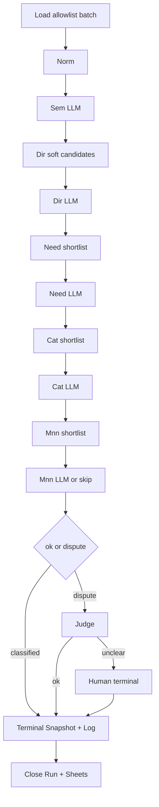

# B2 Workflow plan — `classification-stage2-hierarchy-dev` skeleton

Date: 2026-07-20  
Status: **design accepted; skeleton cloned** — see [`26_B2_EXECUTION_REPORT.md`](26_B2_EXECUTION_REPORT.md); still no activation / no prod Load patch  
Sources: [`20_MIGRATION_PLAN.md`](20_MIGRATION_PLAN.md), [`22_EXPERIMENT_ISOLATION.md`](22_EXPERIMENT_ISOLATION.md), [`23_B1_SQL_PLAN.md`](23_B1_SQL_PLAN.md), [`24_B1_APPLY_REPORT.md`](24_B1_APPLY_REPORT.md), [`../Categories/stage2_workflow_plan.md`](../Categories/stage2_workflow_plan.md), [`../Categories/stage2_workflow_contract.md`](../Categories/stage2_workflow_contract.md)

**Preconditions (met):** §13 cleared; B1 applied on dev (`pharmacy_ai` @ `pharmacypostgres`); `hierarchy_experiment_enabled=false`; allowlist empty.

**B2 goal:** design + safe clone procedure for a **disabled** hierarchy workflow skeleton so a later agent/human can create it in n8n without touching prod Stage 2.

---

## 1. Overview

### 1.1 What B2 delivers

| Deliverable | In B2? |
|-------------|--------|
| Design contract for hierarchy stages (Norm→…→Human) | **Yes** (this doc) |
| Clone procedure for `classification-stage2-hierarchy-dev` (disabled) | **Yes** (procedure only; actual clone = separate explicit ask) |
| Node-group reuse map (In/Run/Load/DB/Fin vs new Sem/Dir/…) | **Yes** |
| Allowlist Load SQL **design** (reads `hierarchy_*` settings) | **Yes** (text only) |
| Activate workflow / enable cron / webhook | **No** |
| Flip `hierarchy_experiment_enabled` | **No** |
| Patch prod `classification-stage2-dev` Load | **No** |
| Implement Sem/Dir/Need/Cat/Mnn LLM prompts (B3+) | **No** |
| Sem validation harness 100/500/1000 | **No** |

### 1.2 Target identity

| Field | Value |
|-------|-------|
| Workflow name | `classification-stage2-hierarchy-dev` |
| `run_type` | `stage2_hierarchy_v1` |
| `workflow_version` (base) | `stage2_hierarchy_v1` |
| Cascade | Norm → Sem → Dir → Need → Cat → optional Mnn → Judge → Human |
| Snapshot policy | **Terminal-only** ([`20`](20_MIGRATION_PLAN.md) §2.2) |
| Intermediate status | `pending_fallback` + precise `next_action` (§2.1) |
| Isolation | allowlist via `pipeline_settings.hierarchy_*` ([`22`](22_EXPERIMENT_ISOLATION.md)) |

### 1.3 Hard constraints

1. **Do not modify** `classification-stage2-dev` (nodes, Load SQL, triggers, credentials wiring).
2. New workflow must be created **disabled / unpublished**.
3. **No** Scheduler / Webhook activation for hierarchy in B2 (even Manual may exist on canvas but workflow stays inactive).
4. **No** prod Stage 2 Load patch in B2 (exclude-allowlist lives as design intent only; setting already seeded).
5. Do not change Stage 1, `categories_dict`, or other tables — B1 already added hierarchy columns + settings.

---

## 2. Current Stage 2 (brief) — what we clone from

Canonical: `classification-stage2-dev` (`BaBjEPi78taRj2G5`). Detail: `Categories/stage2_workflow_contract.md`, journal: `Categories/stage2_workflow_plan.md`.

### 2.1 Zones and flow

```text
In (Manual / Webhook)
  → Run — Create Run + Init Constants
  → Load — Select Batch → Attach Run ID → Limit Batch
  → P1 — Build Prompt → LLM → Post-process → Route
       ├─ classified / human_review → DB (snapshot+log) → Fin
       └─ fallback_2a → 2A (categories + rule branch + LLM) → Route
            ├─ human_review → DB → Fin
            └─ fallback_2b → 2B (branch shortlist + LLM) → Route
                 ├─ classified / human → DB → Fin
                 └─ judge → Judge (Polza) → DB → Fin
  → Fin — Merge Barrier → Pick Run → Close Run → Batch Acceptance
```

| Zone | Role |
|------|------|
| **In —** | Manual + Webhook triggers; batch_size from body |
| **Run —** | `classification_runs` row; `constants` (stages, thresholds, model aliases) |
| **Load —** | Pending + Stage 1 shortlist batch; attach `run_id` |
| **P1 —** | Primary DeepSeek: early `category_id` from rule shortlist |
| **2A —** | Branch (direction / block_family / family_code); no leaf id |
| **2B —** | Leaf `category_id` inside branch shortlist |
| **Judge —** | Polza/Qwen arbitration (`winner_source` llm \| fallback_2b) |
| **DB —** | Prepare Snapshot / Upsert; Prepare Log / Insert; Merge barrier |
| **Fin —** | Close run once; Sheets batch acceptance |
| **Shared —** | DeepSeek / Polza chat models |

### 2.2 Reuse vs replace for hierarchy

| Part | Decision | Notes |
|------|----------|-------|
| In / Run / Load shell | **Reuse** (clone + adapt) | New `run_type`; Load SQL → allowlist design |
| DB Upsert / Insert Log / Prepare* | **Reuse shape** | Extend column maps for hierarchy fields (B1 columns) |
| Fin Close Run / Batch Acceptance | **Reuse** | Once-per-batch barrier pattern |
| `...item.json` + `pairedItem` | **Reuse 1:1** | Invariant |
| Post-process after every LLM | **Reuse pattern** | New stage contracts |
| Merge Context + Categories load | **Reuse pattern** | Per Dir/Need/Cat/Mnn builders |
| Skip-LLM IF | **Reuse pattern** | Single high-score candidate |
| **P1 —** entire zone | **Replace** (do not keep as active path) | Early leaf category |
| **2A —** entire zone | **Replace** | `block_family` ≠ hierarchy |
| **2B —** entire zone | **Replace** | Branch shortlist ≠ need/cat cascade |
| **Judge —** prompt/post-process | **Replace contract** | New hierarchy winner fields |
| Shared DeepSeek / Polza credentials | **Reuse** | Sem…Mnn→DeepSeek; Judge→Polza |

---

## 3. Stages (hierarchy cascade)

Thresholds (initial; from [`20`](20_MIGRATION_PLAN.md) §3): `min_soft_ok=0.50`, `min_category_ok=0.60`, `min_judge_ok=0.60`, `borderline_low=0.40`.

### 3.1 Stage table — sources, snapshot, log, cascade_trace

| Stage | Prefix | Data sources | Item fields (live mid-cascade) | Snapshot columns (terminal upsert only) | Log `stage` | `cascade_trace` use |
|-------|--------|--------------|--------------------------------|------------------------------------------|-------------|---------------------|
| **Norm** | `Norm —` | Load: product text, rule shortlist hint, prep guesses | `normalized_text`, `normalize_meta` | none (no LLM; optional log only) | `normalize` (optional) | init empty / path start |
| **Sem** | `Sem —` | Norm output; soft rule hint; **no** hard category lock | `semantic_attrs`, `semantic_*`, validation flags | `semantic_raw_json`, `semantic_attrs`, `semantic_confidence`, `semantic_explanation`, `semantic_validation_passed`, `semantic_reject_reason` | `semantic_primary` | note soft-continue if `validation_passed=false` |
| **Dir soft cand.** | `Dir —` | `categories_dict` DISTINCT `direction` + Sem attrs | `direction_candidates_json`, `direction_universe` | none mid-path | optional `direction_candidates` | store soft top-N scores |
| **Dir** | `Dir —` | Sem + soft candidates + universe | `selected_direction`, `direction_confidence`, `direction_raw_json` | `selected_direction`, `direction_confidence`, `direction_raw_json` | `direction_select` | `soft_override`, reject `direction_outside_universe` |
| **Need SL** | `Need —` | `categories_dict` where `direction=selected`; Stage 1 shortlist unused as hard lock | `need_shortlist_json`; upsert `classification_shortlist` (`need_in_direction`) | none mid-path | `need_shortlist` (`actor_type=system`) | `membership_only` if soft-fill |
| **Need** | `Need —` | shortlist + Sem + Dir | `selected_need`, `need_confidence`, `need_raw_json` | `selected_need`, `need_confidence`, `need_raw_json` | `need_select` | outside-shortlist / mid-conf flags |
| **Cat SL** | `Cat —` | `categories_dict` under Dir+Need | `category_shortlist_json`; shortlist stage `category_in_need` | none mid-path | `category_shortlist` | empty / relax flags |
| **Cat** | `Cat —` | hard shortlist + cascade attrs | provisional `selected_category_id` / conf / raw on **item** | `category_confidence`, `category_raw_json`; leaf → `final_category_id` **only at terminal** | `category_select` | membership rejects |
| **Mnn SL** | `Mnn —` | `mnn_cluster` for selected category (may be empty) | `mnn_shortlist_json`; stage `mnn_in_category` | none mid-path | `mnn_shortlist` | empty → skip-LLM |
| **Mnn** | `Mnn —` | shortlist or skip | `selected_mnn`, `mnn_confidence`, `mnn_raw_json` (nullable) | `selected_mnn`, `mnn_confidence`, `mnn_raw_json` | `mnn_select` | invalid mnn → judge |
| **Judge** | `Judge —` | full item + all shortlists + trace | may revise selected_* within candidate sets | `judge_*` + confirmed `selected_*` / `final_*` | `judge` | input bundle; record winner |
| **Human** | (terminal from Route) | full item + trace | — | `decision_status=needs_human_review`, `final_source=system`, full cascade fields | `human_review` | persist full path for Sheets |

**Write policy (locked):**

| Outcome | Snapshot upsert | Log insert |
|---------|-----------------|------------|
| Intermediate (`pending_fallback`) | **No** | **Yes** |
| Skip-LLM system select (intermediate) | **No** | **Yes** (`actor_type=system`) |
| Terminal `classified` / `needs_human_review` / `error` | **Yes** | **Yes** |

Mid-cascade accepted fields live on the **n8n item** and in log `output_payload` until terminal snapshot.

### 3.2 Structural flow (skeleton)



### 3.3 Log `stage` values (free text; no CHECK)

`normalize` | `semantic_primary` | `direction_candidates` (optional) | `direction_select` | `need_shortlist` | `need_select` | `category_shortlist` | `category_select` | `mnn_shortlist` | `mnn_select` | `judge` | `human_review`

### 3.4 Shortlist stages (`classification_shortlist`)

| Builder | `stage` | `shortlist_type` | `parent_stage` |
|---------|---------|------------------|----------------|
| Stage 1 (existing) | `primary_rules` | `rule_shortlist` | null |
| Dir soft (optional persist) | `direction_candidates` | `soft_direction` | `semantic_primary` |
| Need | `need_in_direction` | `need_shortlist` | `direction_select` |
| Cat | `category_in_need` | `category_shortlist` | `need_select` |
| Mnn | `mnn_in_category` | `mnn_shortlist` | `category_select` |

---

## 4. Node groups & reuse

### 4.1 Clone-as-shell (B2 skeleton focus)

Per [`20`](20_MIGRATION_PLAN.md) §9.1 B2 exit: **In / Run / Load / DB / Fin** first — create run, load N (or 0), close safely. Cascade LLM zones are **designed** here; **wired as stubs or sticky placeholders** until B3+.

| Group | Source nodes (prod Stage 2) | Hierarchy adaptation in clone |
|-------|----------------------------|-------------------------------|
| **In —** | Manual, Webhook, Webhook Start | Keep on canvas; **workflow disabled**; do not activate Webhook/Scheduler |
| **Run —** | Create Run, Init Constants | `run_type=stage2_hierarchy_v1`; `workflow_name=classification-stage2-hierarchy-dev`; new thresholds (`min_soft_ok`, …); remove P1/2A/2B-only next_action literals or keep unused |
| **Load —** | Select Batch, Attach Run ID, Limit Batch | **Design SQL** = allowlist predicate ([`22`](22_EXPERIMENT_ISOLATION.md)); with `enabled=false` or empty allowlist → 0 rows → empty finish |
| **DB —** | Prepare Snapshot, Upsert, Prepare Log, Insert, Merge | Extend Prepare Snapshot to map B1 columns when terminal; log contract already universal |
| **Fin —** | Merge Barrier, Pick Run, Close Run, Batch Acceptance | Keep once-per-batch; later B10 extends Sheets columns |

### 4.2 Do not activate as path (disable / delete / sticky “retired”)

After clone, **disconnect or sticky-retire** P1 / 2A / 2B zones so they cannot run even on accidental manual execute. Preferred B2 approach: leave JSON nodes but **remove connections** from Load → P1; wire Load → Norm stub (or direct to DB empty path for smoke). Do **not** push changes back into prod workflow file.

### 4.3 New zones (add after shell; B3+)

| Prefix | New nodes (contract) |
|--------|----------------------|
| **Norm —** | `Norm — Normalize Product` |
| **Sem —** | Build Prompt, LLM Prepare, AI Agent, DeepSeek, Merge LLM, Post-process, Route |
| **Dir —** | Soft Candidates, Categories Trigger/Load/Merge Context, Skip LLM?, LLM chain, Post-process, Route |
| **Need —** | Shortlist Builder, Prepare/Insert Shortlist, Skip LLM?, LLM chain, Post-process, Route |
| **Cat —** | Shortlist Builder, Insert, Skip LLM?, LLM chain, Post-process, Route |
| **Mnn —** | Shortlist Builder, Skip-if-empty, optional LLM chain, Post-process, Route |
| **Judge —** | Route, LLM Prepare, Agent, Polza, Merge, Post-process (**new** JSON contract) |

### 4.4 Models

| Stages | Model node pattern |
|--------|-------------------|
| Sem, Dir, Need, Cat, Mnn | DeepSeek (same credential pattern as P1/2A/2B) |
| Judge | Shared Polza / Qwen |

### 4.5 Item invariant

Every Code node returns `{ json: { ...item.json, ... }, pairedItem }`.  
Run reference: `$('Run — Create Run').first().json` — never parallel-branch `$('…')` without Merge Context ancestor.

---

## 5. Isolation & triggers

### 5.1 `pipeline_settings` (already seeded by B1)

| key | Expected value (dev) | Role in hierarchy Load |
|-----|----------------------|------------------------|
| `hierarchy_experiment_enabled` | `{"value": false}` | Kill switch — Load returns 0 if false |
| `hierarchy_load_mode` | `{"mode": "allowlist"}` | Only allowlist supported in v1 |
| `hierarchy_product_allowlist` | `{"product_ids": []}` | Explicit `product_id`s for later Sem waves |
| `hierarchy_exclude_from_prod_stage2` | `{"value": true}` | **Intent only** for future prod Load patch — **not applied in B2** |

### 5.2 Hierarchy Load predicate (design — implement in clone Load SQL later)

```sql
-- Conceptual; enable only when hierarchy_experiment_enabled.value = true
-- AND mode = allowlist AND product_ids non-empty

WHERE p.decision_status = 'pending'
  AND p.rule_decision_status IN ('needs_llm', 'no_match')
  AND (s.stage IS NULL OR s.stage = 'primary_rules')
  AND p.product_id = ANY (
    SELECT jsonb_array_elements_text(value->'product_ids')::bigint
    FROM pipeline_settings
    WHERE key = 'hierarchy_product_allowlist'
  )
ORDER BY random()
LIMIT :batch_size;
```

**B2 safe default:** Load SQL may include the allowlist join **and** a hard gate on `hierarchy_experiment_enabled`, so accidental Manual execute still loads **0 rows** while kill switch is false.

### 5.3 Prod Stage 2 Load

**Out of scope for B2.** Do not append exclude-allowlist to `classification-stage2-dev`. Interim ops rule remains: do not put hot pending IDs on allowlist while prod drain is live ([`22`](22_EXPERIMENT_ISOLATION.md)).

### 5.4 Trigger policy for hierarchy workflow

| Trigger | On canvas after clone? | Active in B2? |
|---------|------------------------|---------------|
| Manual | Allowed (for future smoke) | Workflow **disabled** → no auto-run |
| Webhook | Prefer **remove or leave inactive** | **No** — do not publish URL |
| Scheduler / Cron | **Must not exist** or disabled | **No** |

Checklist after clone:

- [ ] Workflow name = `classification-stage2-hierarchy-dev`
- [ ] Workflow **inactive** / unpublished
- [ ] No Cron node; Webhook not production-registered
- [ ] Credentials = same Postgres/DeepSeek/Polza as Stage 2 (verify IDs, do not point at unrelated DBs)
- [ ] Load SQL is allowlist-gated; `enabled=false` → 0 rows
- [ ] Prod `classification-stage2-dev` unchanged (checksum / no push)
- [ ] `hierarchy_experiment_enabled` still `false`

---

## 6. Snapshot & log fields (B1 columns ↔ stages)

### 6.1 Terminal snapshot map (`product_classification`)

| Column(s) | Origin stage | Notes |
|-----------|--------------|-------|
| `semantic_raw_json`, `semantic_attrs`, `semantic_confidence`, `semantic_explanation`, `semantic_validation_passed`, `semantic_reject_reason` | Sem | Written only on terminal upsert |
| `selected_direction`, `direction_confidence`, `direction_raw_json` | Dir | |
| `selected_need`, `need_confidence`, `need_raw_json` | Need | |
| `category_confidence`, `category_raw_json` | Cat | Leaf id → existing `final_category_id` |
| `selected_mnn`, `mnn_confidence`, `mnn_raw_json` | Mnn | Nullable |
| `cascade_trace` | all stages (assembled on item) | path, soft_override, membership_only, rejects |
| `final_*`, `decision_status`, `next_action`, `routing_hint`, `judge_*` | terminal | Reuse existing columns |
| `latest_run_id`, `workflow_version`, `prompt_version` | terminal | `run_id` from Create Run |

**Not used by hierarchy (leave null):** `llm_*`, `fallback_2a_*`, `fallback_2b_*` — still owned by prod Stage 2.

### 6.2 Log row (`product_classification_log`)

Universal fields already exist: `run_id`, `product_id`, `stage`, `actor_type`, `actor_name`, `status`, `decision_status`, `next_action`, `input_payload`, `output_payload`, `routing_hint`, `selected_category_id`, `confidence`, `explanation`, `validation_passed`, `error_message`, versions.

Hierarchy-specific selections (`selected_direction` / `need` / `mnn`, `semantic_attrs`) go in **`output_payload`** (no new log DDL).

### 6.3 `cascade_trace` (item → terminal jsonb)

Suggested shape (design; refine in B3+):

```json
{
  "path": ["normalize", "semantic_primary", "direction_select", "need_select", "category_select", "mnn_select"],
  "soft_override": false,
  "membership_only": { "need": false, "category": false },
  "rejects": [],
  "notes": []
}
```

Updated after each Post-process; Judge/Human read the full object.

### 6.4 Versions ([`20`](20_MIGRATION_PLAN.md) §11)

| Stage | `prompt_version` |
|-------|------------------|
| Sem | `prompt_semantic_v1` |
| Dir | `prompt_direction_v1` |
| Need | `prompt_need_v1` |
| Cat | `prompt_category_v1` |
| Mnn | `prompt_mnn_v1` |
| Judge | `prompt_judge_hierarchy_v1` |

`workflow_version` stays `stage2_hierarchy_v1` across stages.

---

## 7. Safe clone procedure (n8n) — for implementer

**Do not execute until explicitly requested.** This section is the runbook.

### 7.1 Preferred method

1. Pull latest prod JSON: `python3 scripts/pull_workflow.py classification-stage2-dev` (read-only for clone source).
2. Copy file → `workflows/classification-stage2-hierarchy-dev.json` (or n8n UI Duplicate).
3. In JSON / UI:
   - Set `name` = `classification-stage2-hierarchy-dev`
   - Clear / regenerate `id` so push creates a **new** workflow (never overwrite `BaBjEPi78taRj2G5`).
   - Set `active: false`.
4. Rename sticky notes; update Create Run `workflow_name` / `run_type`.
5. Replace Load SQL with allowlist + kill-switch design (still returns 0 while disabled).
6. Disconnect P1 entry; optional: add Norm stub Code that pass-throughs to Fin via empty DB path for shell smoke.
7. Push **only** the new workflow name: `python3 scripts/push_workflow.py classification-stage2-hierarchy-dev`.
8. Verify in n8n UI: inactive; no schedules; Manual execute → Create Run → 0 products → Close Run `finished_empty`.
9. Confirm `classification-stage2-dev` still active/unchanged.

### 7.2 Post-clone verification checklist

| Check | Pass criteria |
|-------|---------------|
| Isolation | New workflow id ≠ prod; prod JSON untouched |
| Active flag | `active=false` |
| Triggers | No cron; webhook inactive |
| Settings | `hierarchy_experiment_enabled=false`; allowlist `[]` |
| Empty run | Manual → `finished_empty` (or equivalent) without writing random pending products |
| Credentials | Postgres = `pharmacy_ai` / same as Stage 2 |

---

## 8. Out of scope (explicit)

B2 does **not**:

- Activate `classification-stage2-hierarchy-dev` or any Scheduler/Webhook
- Set `hierarchy_experiment_enabled=true` or fill allowlist for Sem waves
- Patch prod Stage 2 Load (exclude allowlist)
- Implement Norm/Sem/Dir/Need/Cat/Mnn/Judge LLM prompts and post-process (→ B3–B9)
- Run Sem validation 100/500/1000 (→ B4)
- Change Stage 1, `categories_dict`, or add more DDL
- Enable Telegram HITL
- Cutover / dual-run compare (→ B11)

---

## 9. Suggested next steps after B2 design acceptance

| Step | Ask | Exit |
|------|-----|------|
| B2 implement | “Clone hierarchy workflow in n8n per `25_B2_WORKFLOW_PLAN.md`” | Disabled shell; empty Close Run OK |
| B3 | Norm + Sem E2E + log | 10-item smoke (allowlist + kill switch on for that smoke only) |
| B4 | Sem validation waves | Gate before Dir+ |

---

## 10. Sign-off

| Item | Status |
|------|--------|
| Current Stage 2 zones documented | Yes |
| Hierarchy stage ↔ snapshot/log/trace table | Yes |
| Clone + isolation + trigger safety | Yes |
| B1 columns linked | Yes |
| Actual n8n clone / activation | **Not done** — waiting for explicit request |

*Draft revision: 2026-07-20 — B2 design only.*
