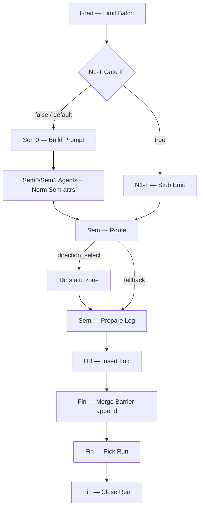

# 43 — B4.3b-T.1 N1-T implementation package (design only)

```text
Status: Design only — seam/load/settings/runtime not authorized.
Purpose: prepare a narrow future N1-T static patch and a one-run plan.
Verdict: N1_T_IMPLEMENTATION_PACKAGE_PARTIAL
```

**Date:** 2026-09-12  
**Canon:** `redesign/42_B4_3B_T_N1_PRESEM_SEAM_DESIGN.md` (`N1_T_PLAN_READY`, T1)  
**Workflow:** `classification-stage2-hierarchy-dev` / `o8sugljHYuUs7IEC`  
**Structured twin:** `redesign/artifacts/b4_3b_t_n1_presem_seam_package_v1.json`

---

## A. Readiness and exact scope

Future patch **may** touch only:

```text
- hierarchy-dev workflow only;
- T1 branch after Load — Limit Batch;
- one fail-closed gate (+ optional stamp of gate fields);
- one Stub Emit;
- temporary Cap/batch=1 enforcement for the smoke window;
- temporary exact-ID Load clause for one run;
- temporary Mode A settings (existing keys) + optional proposed N1-T keys;
- no Sem prompt change;
- no real categories_dict;
- no Need;
- no snapshot reconnect.
```

**Why PARTIAL (not READY):** export supports exact T1 edges and downstream field contracts, but three operational contracts remain `TO_CONFIRM` before implementation:

1. Gate storage locus (G3 temporary Init stamp vs G1 new `pipeline_settings` keys).  
2. How CLI Manual `{}` forces `effective_batch_size=1` (N=0 used default **5**).  
3. Exact temporary Load SQL eligibility vs owner-chosen `product_id` (join/`decision_status` filters).

---

## B. Existing topology evidence (from current export)

### B.1 Limit neighborhood

```text
Norm — Normalize Product → Load — Limit Batch
Load — Limit Batch → Sem0 — Build Prompt   (ONLY outgoing main edge today)

Limit.maxItems = {{ $('Run — Create Run').first().json.batch_size || 5 }}
```

### B.2 Sem0 / Sem1 live path (unchanged when gate=false)

```text
Limit
→ Sem0 — Build Prompt → Sem0 — LLM Prepare
    → Sem0 — AI Agent (+ Sem0 — DeepSeek ai_languageModel)
    → Sem0 — Merge LLM (combineByPosition) → Sem0 — Post-process
→ Sem — Build Prompt → Sem — LLM Prepare
    → Sem — AI Agent (+ Sem — DeepSeek)
    → Sem — Merge LLM → Sem — Post-process
→ Norm — Normalize Sem attrs
→ Sem — Route
```

### B.3 Sem — Route

```text
Switch: $json.next_action equals "direction_select"
  output 0 (direction_select) → Dir — Candidate Builder
  output 1 (fallback/extra)   → Sem — Prepare Log
```

**Confirmed required field for Dir branch:** `next_action === "direction_select"`.

### B.4 Direction path

```text
Dir — Candidate Builder → Dir — Prepare Payload → Dir — Static Post-process
→ Sem — Prepare Log → DB — Insert Log → Fin — Merge Barrier (input index 1)
→ Fin — Pick Run → Fin — Close Run
```

Dir Candidate sets `direction_candidate_scope.candidate_scope_status = not_loaded_static`, `direction_static=true`.  
Dir Static Post (happy static empty scope) sets among others:

```text
stage = direction_select
decision_status = pending_fallback
next_action = need_select
stop_reason = need_not_implemented_static
direction_candidate = null  (null-over-invention)
selected_category_id not set / remains null through Prepare Log
```

### B.5 Prepare Log direction detection (export)

```text
isDirection = (stage === 'direction_select') || (direction_static === true)
```

Then logs Direction soft fields; `selected_category_id` forced null;  
`prompt_version` inherits `j.prompt_version` or falls back to `prompt_semantic_v2`.

### B.6 Snapshot vs Barrier

```text
DB — Prepare Snapshot ← P1/2B/Judge routes only (NOT Sem/Dir)
DB — Upsert Snapshot → Fin — Merge Barrier (input index 0)
DB — Insert Log      → Fin — Merge Barrier (input index 1)

Barrier typeVersion 3.2; parameters {}; notes: "append: Upsert + Insert"
```

**Finding:** Barrier is documented as **append** (not Sem-style `combineByPosition`). Snapshot is present but **unreachable** from Sem/Dir. Sem log-only waves historically completed → Insert-only into append Barrier is the intended N>0 close path. Re-verify once at first N1-T static accept (`TO_CONFIRM` live Merge default if notes diverge from engine default).

### B.7 Close Run aggregation (confirmed risk)

```text
stats FROM product_classification WHERE latest_run_id = run_id
status = finished_empty when total_count = 0
```

Log-only N>0 **does not** update snapshot → Close will likely report `finished_empty` / zero success_count even if a product was logged. **Do not promise** finished/success_count; capture observed.

### B.8 Current Load SQL (exact quote)

```sql
-- B2 skeleton stub: never drain pending pool
SELECT
  NULL::bigint AS product_id,
  NULL::bigint AS product_raw_id
WHERE false;
```

### B.9 Batch Cap / Attach (confirmed fields)

Cap writes: `requested_batch_size`, `effective_batch_size`, `batch_size`, `batch_cap_version`.  
Attach writes: `run_id`, `run_meta.{requested_batch_size,effective_batch_size,batch_cap_version,...}` plus `...item.json`.

**N=0 CLI fact:** Manual `{}` → `requested_batch_size=null`, `effective_batch_size=5`.

---

## C. T1 patch blueprint

### Target wiring (matches export; only Limit out-edge changes)

```text
Load — Limit Batch
→ N1-T — Gate IF
   ├─ false → Sem0 — Build Prompt   (original Sem0/Sem1 path UNCHANGED)
   └─ true  → N1-T — Stub Emit
              → Sem — Route
                 ├─ direction_select → Dir… → Prepare Log → Insert Log → Barrier → Pick → Close
                 └─ fallback → Prepare Log → … (must not happen if stub sets next_action correctly)
```

**Does not** enter `Norm — Normalize Sem attrs` on the true branch (see §E).

### Change table

| Change ID | Node/edge | Action | Purpose | Allowed data | Forbidden data | Rollback |
|---|---|---|---|---|---|---|
| C1 | `Load — Limit Batch` → `Sem0 — Build Prompt` | Remove direct edge | Open T1 branch point | — | Accidental dual fan-out | Restore edge |
| C2 | `N1-T — Gate IF` (new IF) | Add; Limit → Gate | Fail-closed branch | boolean from stamped `n1_presem_smoke_enabled` | Soft true without stamp | Delete node |
| C3 | Gate false → `Sem0 — Build Prompt` | Add edge | Preserve normal Sem | — | — | Remove with C2 |
| C4 | `N1-T — Stub Emit` (new Code) | Add; Gate true → Stub → `Sem — Route` | Synthetic Sem-compatible item; full gate checks; throw on mismatch | test markers + Route/Dir fields | category/final/LLM/candidates | Delete node |
| C5 | Stamp fields (Init and/or Cap) | Temporary patch | Put gate + batch=1 on items | n1_* flags; batch 1 | Permanent enabled=true | Restore backup |
| C6 | `Load — Select Batch` query | Temporary Mode C | Exact ID + LIMIT 1 | one approved id | pending drain / random | Restore `WHERE false` |
| C7 | `pipeline_settings` Mode A | Temporary write | experiment=true; allowlist=[id] | same id as C6 | other ids | enabled=false; `[]` |
| C8 | Sticky note (optional) | Add | Operator warning: temporary N1-T | — | — | Delete |

### Mermaid (proposed)



---

## D. Gate storage and fail-closed behavior

| Option | Gate location | DB/settings write | Visibility | Fail-closed quality | Recommendation |
|---|---|---|---|---|---|
| **G1** | new `pipeline_settings` keys (`n1_presem_smoke_*`) | yes | high | high if Postgres stamp node feeds IF | Optional later; needs schema/settings approval |
| **G2** | Manual/CLI payload only | no | per-run | weak under CLI (`{}` / pinData ignored) | Insufficient alone for CLI N=0 method |
| **G3** | Temporary Init Constants / Cap stamp in workflow patch | no new keys | medium (export-visible) | **high** if default absent ⇒ false | **Recommended for first N1-T patch** |

### Recommended (proposed): **G3 primary + Mode A Load controls**

```text
- Smoke-window workflow patch stamps on items (via Init and/or post-Cap stamp):
    n1_presem_smoke_enabled = true|false  (default false in restored export)
    n1_presem_smoke_product_id = <approved>
    n1_presem_smoke_mode = "n1_presem_smoke"
    force requested/effective batch_size = 1 while enabled
- Mode A still required for Load isolation (existing keys only).
- G1 new keys = TO_CONFIRM / not required for MVP package.
```

### Gate inputs (all required for Stub pass)

```text
test_mode / n1_presem_smoke_mode = n1_presem_smoke
test_enabled / n1_presem_smoke_enabled = true
approved_product_id = exact ID (matches stamp)
requested_batch_size = 1
effective_batch_size = 1
workflow identity = o8sugljHYuUs7IEC / classification-stage2-hierarchy-dev
loaded_product_count = 1
item.product_id === approved_product_id
llm_allowed = false  (implied: true-branch never calls Agents)
```

### Outcomes

| Condition | Outcome |
|---|---|
| `enabled` absent/false | Gate IF → **Sem0 path** (normal; with Load `WHERE false` stays N=0-safe) |
| `enabled=true` and all Stub checks pass | Stub → Sem Route → Dir → Log → Close |
| `enabled=true` and any check fails | **Code throw** (existing stop pattern); **no** Sem0, **no** synthetic Dir |
| Invented “silent Sem bypass” when enabled=false | **Forbidden** |

---

## E. Stub Emit payload contract

### Downstream needs (confirmed)

| Consumer | Needs from item |
|---|---|
| Sem — Route | `next_action === "direction_select"` |
| Dir — Candidate | any item; builds empty static scope |
| Dir — Prepare | `run_id`, `product_id`, `product_raw_id`, `normalized_text`, kind/profile/attrs if present; `semantic_*` optional |
| Dir — Static Post | scope + optional raw; emits Direction result fields |
| Sem — Prepare Log | `direction_static` / `stage=direction_select` for Direction shaping; `prompt_version` optional |

### Norm — Normalize Sem attrs: **SKIP on N1-T true branch**

```text
Reason (export-based):
- only consumer before Route today is Sem Post → Norm Sem → Route;
- Route switches solely on next_action;
- Dir Prepare reads semantic_* optionally and tolerates nulls;
- entering Norm Sem attrs risks policy side-effects on null/partial attrs
  without improving Route.
Proposed: Stub → Sem Route directly.
```

### Field classification

**Preserve unchanged from upstream (`...item.json` + Attach/Norm Product):**

```text
product_id, product_raw_id (if present),
run_id, run_meta,
normalized_text, product_kind / product_family / profiles if present,
combined_text / shortlist fields if present from Load,
requested_batch_size, effective_batch_size, batch_size, batch_cap_version,
pairedItem / linking,
constants (from Init)
```

**Confirmed Sem-like fields Stub must set for Route/Dir/Log:**

```text
next_action = direction_select          (Route)
decision_status = pending_fallback
selected_category_id = null
semantic_validation_passed = true
semantic_reject_reason = null
semantic_confidence = null
semantic_attrs = {} or nulls for mnn/form/route
semantic_explanation = n1_presem_stub_no_llm
```

**Proposed stub-only markers:**

```text
test_mode = n1_presem_smoke
test_synthetic_sem = true
test_fixture_version = n1_presem_stub_v1
llm_called = false
workflow_version = hierarchy_n1_presem_smoke_v1
prompt_version = test_stub_no_llm_v1   # intentionally NON Option-A
direction_static = true               # helps Prepare Log isDirection
stage = direction_select              # optional pre-Dir; Dir will set again
```

**Must not set / overwrite:**

```text
category_id, final_*, classified, final_source,
real candidate lists, real LLM raw/metadata,
snapshot payloads, invented MNN/form/route/direction
```

After Dir Static Post, expect log stage path to be **Direction-shaped** (`isDirection=true`).  
**Proposed:** **one** `product_classification_log` row for this item/run (Direction), not a separate `semantic_primary` row (Sem Post skipped). Confirm at runtime.

---

## F. Load exact-ID dual-control contract

### Current default (must remain after rollback)

Exact stub quoted in §B.8 (`WHERE false`).

### Future temporary mode — **BOTH** layers required

```text
1. Mode C: temporary Load SQL with exact product_id predicate AND hard LIMIT 1
   (derive from scripts/sem_smoke_patch_workflow.py SMOKE_LOAD_SQL family;
    narrow to single ID — exact text TO_CONFIRM at implement time)
2. Mode A: hierarchy_experiment_enabled=true
           hierarchy_product_allowlist.product_ids = [<same id>]
3. N1-T stamps enabled + matching product_id + batch effective=1
4. Rollback: WHERE false + allowlist=[] + experiment=false + workflow backup
```

| Layer | Workflow JSON patch | DB/settings write | Owner approval | Post-run rollback |
|---|---|---|---|---|
| Mode C Load | yes + push | no (SQL in node) | yes | restore SQL |
| Mode A | no | yes | yes | restore settings |
| T1 seam + stamps | yes + push | no (G3) | yes | restore export |
| G1 keys (optional) | maybe stamp node | yes | separate | restore keys |

**No random pending selection.**

If temporary Load join (`product_classification` ⋈ `classification_shortlist` + status filters) rejects the chosen ID → **selection blocked** (`TO_CONFIRM` per candidate).

---

## G. Log / Barrier / Close plan

| Topic | Finding |
|---|---|
| Barrier | Notes = append Upsert+Insert; Sem/Dir only hit Insert→input 1; Snapshot dark |
| Pick | With `batch_size=1`, closes after one barrier completion |
| Close | Aggregates **snapshot** `latest_run_id`, not logs → likely `finished_empty` for log-only N=1 |
| Stages | Proposed **one** Direction log; not semantic_primary (Sem skipped) |
| Markers in log JSON / payloads | `test_mode`, `test_synthetic_sem`, `test_fixture_version`, `llm_called=false`, plus Dir: `candidate_scope_status=not_loaded_static`, `direction_candidate=null`, `selected_category_id=null`, `stop_reason=need_not_implemented_static` |

Prepare Log must surface test markers via `input_payload` / `output_payload` JSON (**proposed:** ensure Stub+Dir fields flow into those blobs; verify against Prepare Log mapping at implement — partial field wiring = `TO_CONFIRM`).

---

## H. Product selection package (no ID)

Checklist before future run:

```text
- exact ID exists in temporary Load source join;
- dry-run returns exactly one row;
- not in active production Stage 2 processing;
- no concurrent hierarchy-dev live execution;
- stable normalized_text / combined_text;
- ordinary card; no ambiguity; not 26346;
- no external retrieval / MNN judgment needed;
- baseline snapshot+log read-only captured;
- same ID in allowlist stamp and N1-T product stamp.
```

**Proposed read-only query shapes** (not executed; not final):

```text
- classification_runs open/running for product / workflow;
- product_classification row for id;
- classification_shortlist primary_rules row for id;
- dry-run of approved temporary Load SQL;
- pipeline_settings allowlist/experiment baseline.
```

Label: `proposed read-only query shape` until Load SQL variant fixed.

---

## I. Static acceptance and rollback

### Static accept after future patch (before run)

```text
- default restored export still WHERE false / enabled false / no seam OR seam present with enabled=false → Sem0 edge only;
- missing gate inputs ⇒ Gate false → Sem0 (or throw if enabled without match — document chosen);
- Sem Agents bypass only on Gate true + Stub pass;
- Stub cannot reach Snapshot;
- Stub cannot set category/final;
- Direction remains static;
- one Close path for non-empty (Insert→Barrier→Pick→Close);
- batch cap still on path before Create Run;
- named rollback artifacts prepared.
```

### Post-run rollback

```text
1. restore workflow from pre-N1-T backup (seam removed);
2. Load WHERE false;
3. allowlist=[]; experiment=false;
4. fresh pull + SHA/diff verify;
5. no second run without new approval.
```

---

## J. Decision outcome

```text
N1_T_IMPLEMENTATION_PACKAGE_PARTIAL
```

Topology, Route/Dir/Log field contracts, Barrier append finding, Close snapshot-stats caveat, and T1 change IDs are export-backed.  
Not READY until gate locus, CLI `batch_size=1`, and exact Load SQL eligibility are resolved under owner approval.

---

## K. Explicit next boundary

```text
This package does not authorize:
- seam implementation;
- Load patch;
- settings/allowlist write;
- push;
- N=1 run;
- LLM;
- activation/webhook;
- Need;
- real categories_dict;
- snapshot;
- Wave-500;
- production changes.
```

**Approvals before implementation coding:**

```text
1. Accept PARTIAL package + resolve TO_CONFIRM (G3 vs G1; batch=1 CLI mechanism; Load SQL variant).
2. Approve T1 node/edge patch on hierarchy-dev only.
3. Approve Mode C+A temporary window + exact product_id.
4. Approve push of temporary patch.
5. Separate message to approve the single CLI N1-T run.
6. Mandatory rollback verification.
```

---

## L. TO_CONFIRM (main)

```text
- G3 vs G1 for gate flags;
- CLI mechanism for effective_batch_size=1 (Cap stamp vs runner inject);
- exact temporary Load SQL text + eligibility vs candidate IDs;
- Barrier engine default vs notes=append (spot-check);
- Prepare Log payload inclusion of all test_* markers;
- observed Close status for log-only N=1;
- whether Gate IF reads stamped item field vs constants path.
```

---

## Explicitly not changed

- n8n workflows: not changed
- n8n runtime/executions/webhooks: not run
- PostgreSQL schema/data: not changed
- SQL: not executed or changed
- production Stage 2: not changed
- hierarchy-dev runtime settings: not changed
- Load / allowlist / kill switch: not changed
- snapshot / attr_*: not changed
- Sem0/Sem1 prompts and prompt versions: not changed
- real categories_dict data: not loaded
- Need / Category / Mnn / Judge / Telegram: not added
- source and freeze evidence artifacts: not changed
- Git commit/push: not performed
